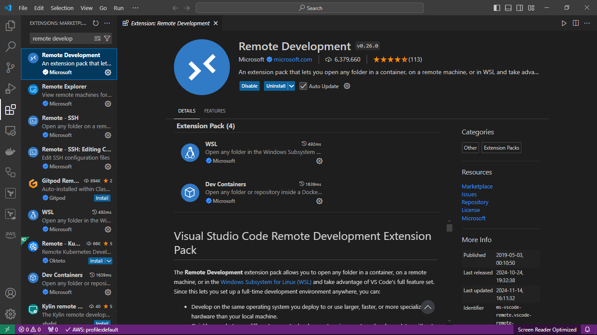
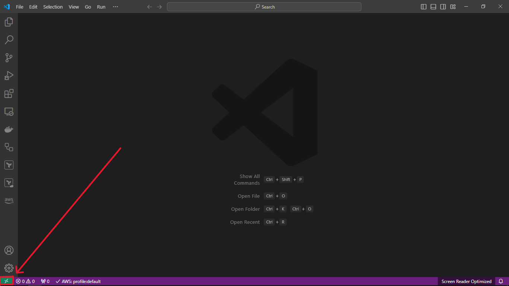
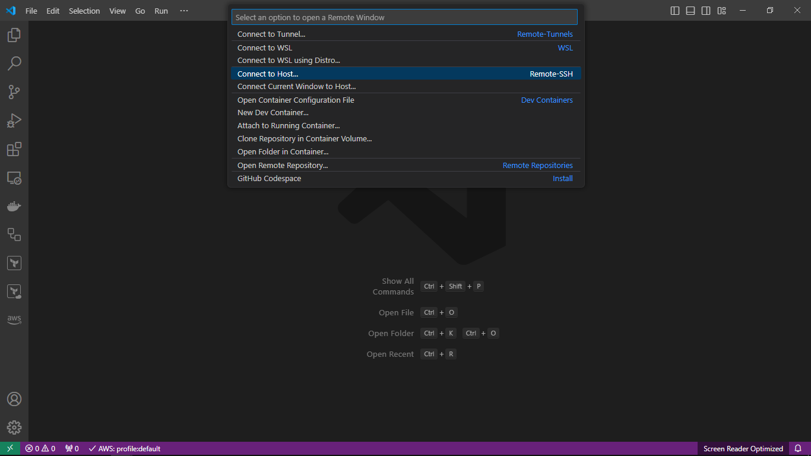
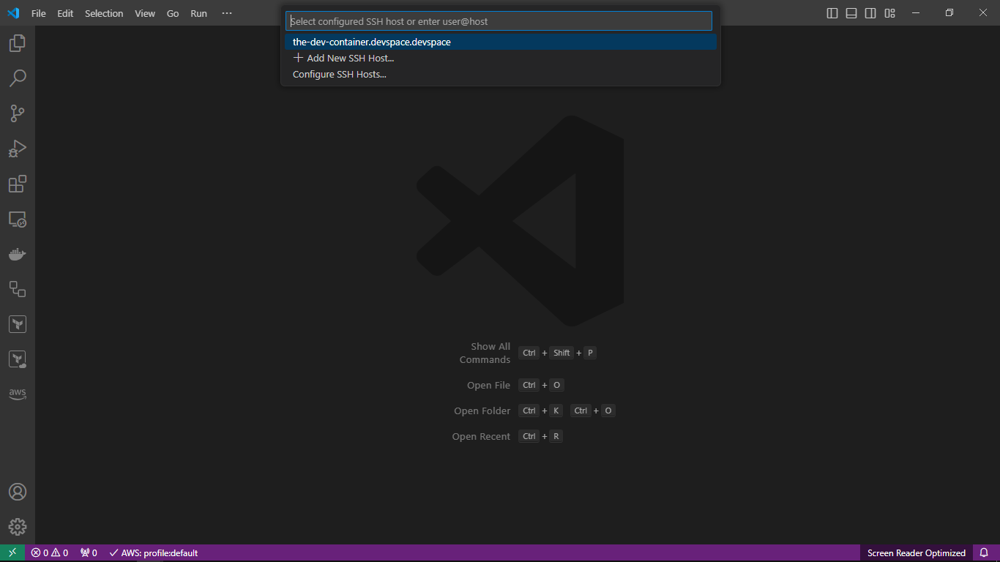

# Dev Containers on EKS using DevSpace

DevSpace is an open-source developer tool for Kubernetes that lets you develop and deploy cloud-native software faster.  DevSpace is a very lightweight, client-only CLI tool which uses your current kube-context, just like kubectl or helm. DevSpace, also falls in the category of dev container tools.
Three of the most striking features of DevSpace are:
- configurable out of the box SSH server injection, as well as the
- two-way sync capability between local host file system and development container file system, and that
- DevSpace development containers run on Kubernetes.

---

## Prerequisites
1. DevSpace installed.
2. Kubectl installed.

> Follow this [link](https://www.devspace.sh/docs/getting-started/installation?x0=6) for DevSpace installation.

---

## Steps
> Assuming that we already have access to a Kubernetes cluster and that we have pointed kubectl to use the corresponding context. As a best practice we should create a unique kubernetes namespace eg. **devspace**, for our development environment and then tell DevSpace to use the targeted context and namespace.
1. Create the **devspace** directory.
2. Open the Powershell window & change directory to the above-created **devspace** directory.
3. Run the following command to create kubernetes namespace for DevSpace.
    - **`kubectl create namespace devspace`**
4. Then, run the following command to make DevSpace use above-created specific namespace.
    - **`devspace use namespace devspace`**
5. Now, run the following command to set the DevSpace context to kubectl current context.
    - **`devspace use context "$(kubectl config current-context)"`**
6. Run the following command to initialize the DevSpace tool in the directory.
    - **`devspace init`**
7. To start the **dev container** inside **Pod**, run the following command by providing the dev container image.
    - **`devspace dev --var THE_DEV_CONTAINER_IMAGE="dev-container-image"`**  
    Replace the *dev-container-image* with the name of the image for dev container.
8. Dev Container pod will deployed and ssh credentials will be added into *~/.ssh/config* file.
9. To check the deployed dev container, run the following command in the new powershell window:
    - **`kubectl get all -n devspace`**

---

## Install Remote Development Extension
1. Open VSCode.
2. Open *Extensions* tab.
3. Type **`remote development`** or paste this **`ms-vscode-remote.vscode-remote-extensionpack`** extension id in the search bar.
4. Install this extension.

5. Once you install the Remote Development extension, a new symbol named **Remote Host** and labeled **Open a Remote Window** will be added to the VSCode status bar.

---

## Connect the VSCode with the Dev Container Pod
1. Open the VSCode.
2. Click on the **Remote Host** symbol present on the VSCode status bar.

3. From the dropdown, click on **Connect to Host**.

4. Then select the **the-dev-container.devspace.devspace**.

5. A new window will be opened with connection to **dev container pod**.

---

### Hence, in this way, we can start a **Dev Container on Kubernetes Pod**.

---