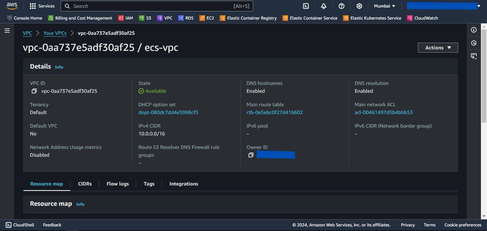
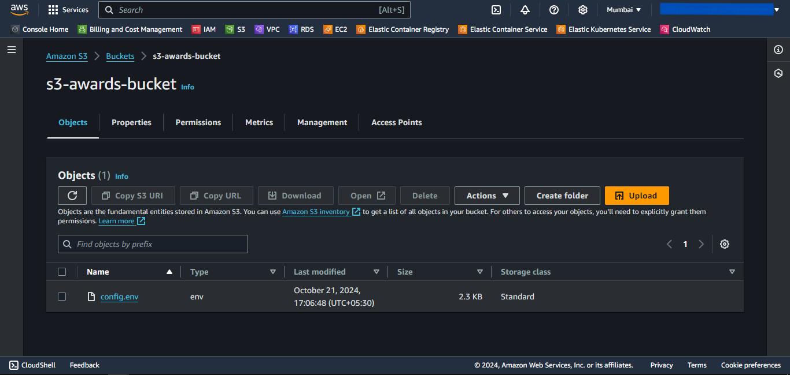
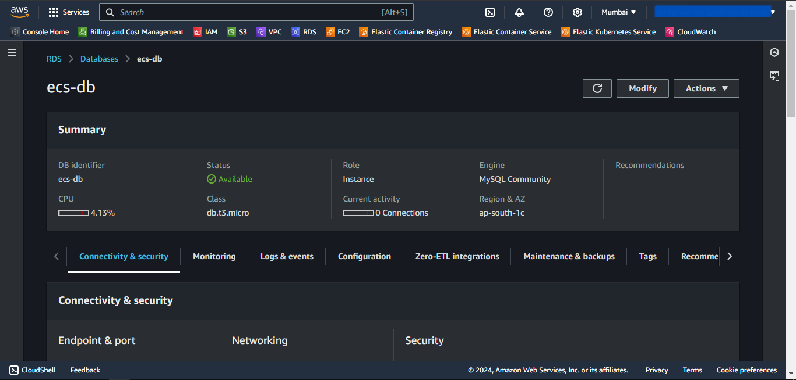
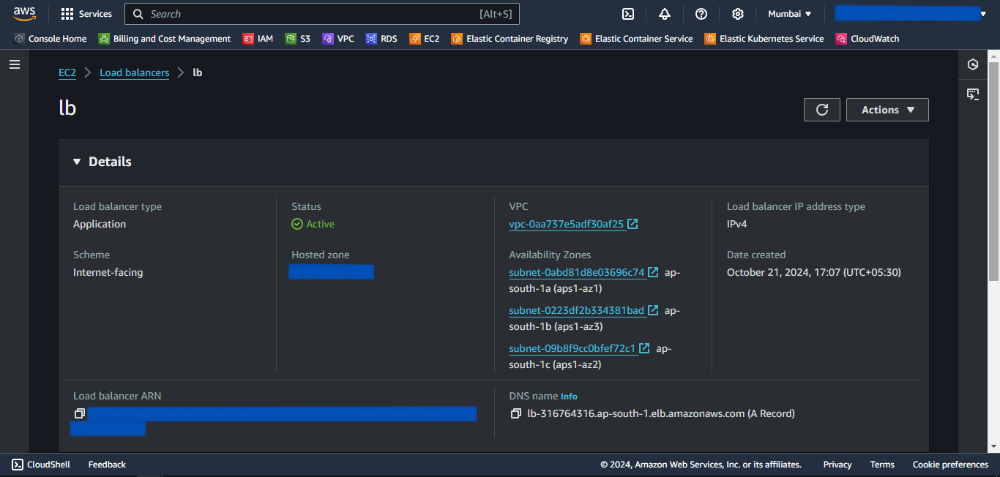
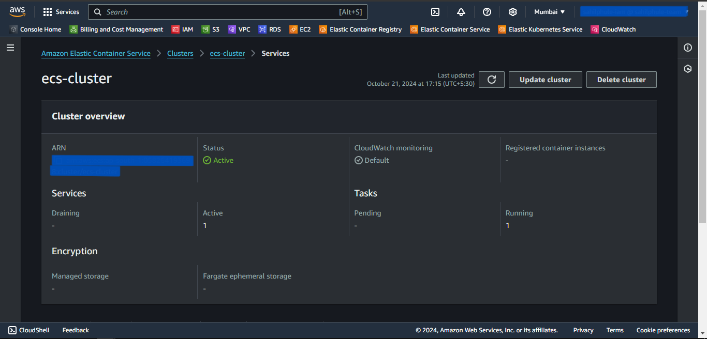
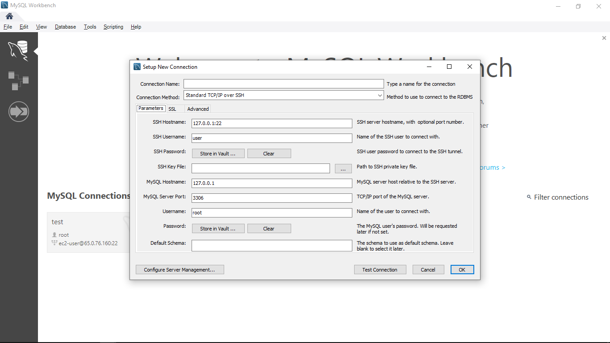

# AWS ECS Provisioning using Pulumi

## Prerequisites
1. An AWS account with an IAM user having sufficient permissions.
2. AWS CLI installed and configured with the IAM user.
3. Pulumi Installed.

---
## Steps
1. Create a Pulumi Project directory.
2. Open the PowerShell.
3. Change the directory to the above-created Pulumi Project.
4. Run the `pulumi new aws-python` command to initialize the *pulumi*.
5. Provide the appropriate values to prompts such as *project-name*, *project-description*, *stack-name*, *toolchain*, *region-name*, etc.
6. This will generate some Pulumi files in this directory.
7. Now we will install predefined Pulumi modules.
8. Activate the `venv` by running `venv\Scripts\activate`.
9. Run `pip install git+https://github.com/sahilphule/pulumi.git` to install the modules.
10. Deactivate the `venv` by running `deactivate`.
11. Now open the directory in the preferred IDE.
12. Create *commons* folder
13. Inside the folder create *__init__.py* file.
14. Import the following in the *__init__.py* file:
    - from inflection_zone_pulumi.modules.aws.vpc import vpc
    - from inflection_zone_pulumi.modules.aws.s3 import s3
    - from inflection_zone_pulumi.modules.aws.rds import rds
    - from inflection_zone_pulumi.modules.aws.load_balancer import load_balancer
    - from inflection_zone_pulumi.modules.aws.ecs import ecs
15. The reference code is attached below.
```py
from inflection_zone_pulumi.modules.aws.vpc import vpc
from inflection_zone_pulumi.modules.aws.s3 import s3
from inflection_zone_pulumi.modules.aws.rds import rds
from inflection_zone_pulumi.modules.aws.load_balancer import load_balancer
from inflection_zone_pulumi.modules.aws.ecs import ecs
```
16. Definition of *__init__.py* is complete.
17. Now create the *values.py* file in the root folder of the created project directory.
18. Define the following values:
    - vpc_properties
        - vpc-name
        - vpc-igw-name
        - vpc-public-rt-name
        - vpc-private-rt-name
        - vpc-public-subnet-name
        - vpc-private-subnet-name
    - s3_properties
        - s3-bucket-name
        - s3-bucket-versioning
        - s3-env-file-path
    - rds_properties
        - db-subnet-group-name
        - db-sg-name
        - db-identifier
        - db-allocated-storage
        - db-engine
        - db-engine-version
        - db-instance-class
        - db-username
        - db-password
        - db-publicly-accessible
        - db-skip-final-snapshot
    - bastion_properties
        - bastion-host-sg-name
        - bastion-host-key-public-file
        - bastion-host-instance-type
        - bastion-host-name
    - ecs_properties
        - ecs-cluster-name
        - ecs-task-execution-role-name
        - ecs-task-family-name
        - ecs-container-name
        - ecs-container-image-name
        - ecs-container-port
        - s3-config-bucket
        - s3-config-path
        - ecs-service-name
        - ecs-service-desired-count
    - ecs_container_definition
    - load_balancer_properties
        - load-balancer-sg-name
        - load-balancer-tg-name
        - port
19. The reference code is attached below.
```py
vpc_properties = {
    "vpc-name": "ecs-vpc",
    "vpc-igw-name": "ecs-vpc-igw",
    "vpc-public-rt-name": "ecs-vpc-public-rt",
    "vpc-private-rt-name": "ecs-vpc-private-rt",
    "vpc-public-subnet-name": "ecs-vpc-public-subnet",
    "vpc-private-subnet-name": "ecs-vpc-private-subnet"
}

s3_properties = {
    "s3-bucket-name": "",
    "s3-bucket-versioning": "Disabled",
    "s3-env-file-path": ""
}

rds_properties = {
    "db-subnet-group-name": "ecs-db-subnet-group",
    "db-sg-name": "ecs-db-sg",
    "db-identifier": "ecs-db",
    "db-allocated-storage": 10,
    "db-engine": "mysql",
    "db-engine-version": "8.0",
    "db-instance-class": "db.t3.micro",
    "db-username": "",
    "db-password": "",
    "db-publicly-accessible": False,
    "db-skip-final-snapshot": True,
}

bastion_properties = {
    "bastion-host-sg-name": "ecs-db-bastion-host-sg",
    "bastion-host-key-public-file": "",
    "bastion-host-instance-type": "t2.micro",
    "bastion-host-name": "ecs-db-bastion-host"
}

ecs_properties = {
    "ecs-cluster-name": "ecs-cluster",
    "ecs-task-execution-role-name": "ecs-task-execution-role",
    "ecs-task-family-name": "ecs-task-family",
    "ecs-container-name": "",
    "ecs-container-image-name": "",
    "ecs-container-port": "",
    "s3-config-bucket": s3_properties["s3-bucket-name"],
    "s3-config-path": "",

    "ecs-service-name": "ecs-service",
    "ecs-service-desired-count": 1
}

ecs_container_definition = [
    {
        "name": ecs_properties["ecs-container-name"],
    	"image": ecs_properties["ecs-container-image-name"],
		"essential": True,
		"portMappings": [
            {
                "containerPort": ecs_properties["ecs-container-port"],
       			"hostPort": ecs_properties["ecs-container-port"],
				"protocol": "tcp"
			}
        ],
	    "environment": [
            {
				"name": "S3_CONFIG_BUCKET",
                "value": ecs_properties["s3-config-bucket"]
			},
            {
                "name": "S3_CONFIG_PATH",
                "value": ecs_properties["s3-config-path"]
	        }
        ]
	}
]

load_balancer_properties = {
    "load-balancer-sg-name": "ecs-lb-sg",
    "load-balancer-tg-name": "ecs-lb-tg",
    "port": ecs_properties["ecs-container-port"]
}
```
20. The definition of *values.py* is complete.
21. Now navigate to the *__main__.py* file present in the root folder of the above-created project directory.
22. Clear the code if present.
23. Import the following:
    - pulumi
    - pulumi_aws as aws
    - from commons import vpc, s3, rds, load_balancer, ecs
    - values
24. Define the following objects and pass the values as an argument:
    - VPC
    - S3
    - RDS
    - Load_balancer
    - ECS
    - bucket_object
25. The reference code is attached below.
```py
import pulumi
import pulumi_aws as aws
from commons import vpc, s3, rds, load_balancer, ecs
import values

VPC = vpc(values)
S3 = s3(values)
RDS = rds(values, VPC)
Load_balancer = load_balancer(values, VPC)
ECS = ecs(values, VPC, Load_balancer)

bucket_object = aws.s3.BucketObject(
    "config.env",
    
	bucket = S3.s3_bucket.id,
    source = pulumi.FileAsset(values.s3_properties["s3-env-file-path"])
)
```
26. Definition of *__main__.py* is complete.

---

## Provisioning the Infrastructure
Now we will provision the infrastructure by applying the above-created configuration files.

> Ensure AWS CLI is configured with appropriate AWS user credentials and enough permissions.

### Steps:
1. Open the PowerShell.
2. Change the directory to the above-created Pulumi Project.
3. Run the `pulumi up` command and if prompted, select `yes` to provision the infrastructure onto the AWS Cloud.
4. Head to the AWS Console, and verify the created resources.
5. Access the service onto the browser using the load balancer url received by running `pulumi stack output url`.

---

<br>
<br>
<br>
<br>
<br>
<br>
<br>
<br>
<br>
<br>
<br>
<br>
<br>
<br>
<br>
<br>
<br>
<br>
<br>

## Screenshots of Provisioned Infrastructure
---

### VPC Image


---

### S3 Image


---

<br>
<br>
<br>
<br>
<br>
<br>
<br>

### RDS Image


---

### LB Image


---

<br>
<br>
<br>
<br>
<br>
<br>
<br>
<br>
<br>

### ECS Image


---

## Connect to the RDS database through Bastion Host
1. Open MySQL Workbench.
2. Click Add Connection.
3. Select connection method as **Standard TCP/IP over SSH**.
4. In SSH Hostname, enter *bastion-host-ip:22* where bastion-host-ip is received from `pulumi stack output bastion-host-ip` command.
5. In SSH Username, enter *ec2-user*.
6. In SSH Key File, select *bastion-key.pem* file passed in above *values.py* file from your local computer.
7. In MySQL Hostname, enter *DB_HOST* where DB_HOST is received from `pulumi stack output DB_HOST`.
8. In the Password section, select *Store in Vault*, and enter the password passed in above-created *values.py* file.
9. Click *OK* and open the connection.
10. Now you can run MySQL commands to access databases and verify the successful connection of *ecs-service*.

---

<br>
<br>
<br>
<br>
<br>
<br>
<br>
<br>
<br>
<br>
<br>

## Screenshots of MySQL Workbench

---

### Connection Page


---

### Commands Page


---

<br>

## Destroy the provisioned infrastructure

1. To destroy infrastructure, change the directory to the above-created Pulumi Project.
2. Run `pulumi destroy` & if prompted, select `yes`.
3. Infrastructure will be destroyed.

---