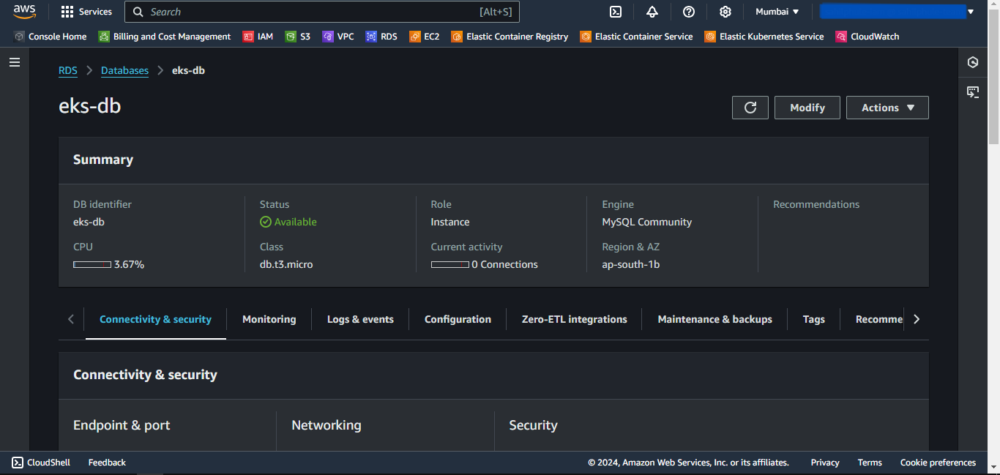
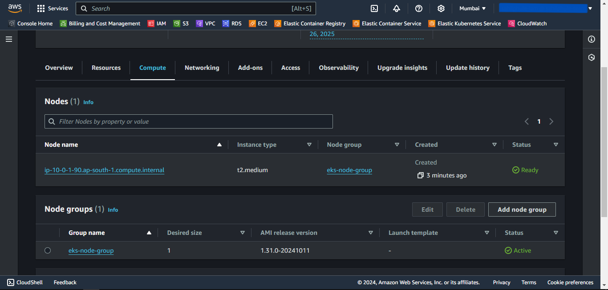
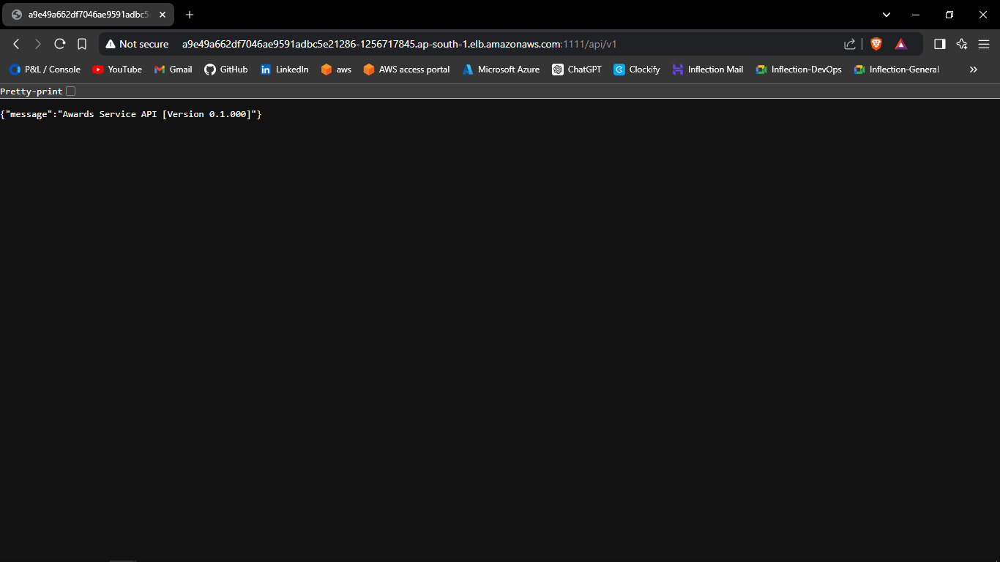

# AWS EKS Provisioning using Pulumi

## Prerequisites
1. An AWS account with an IAM user having sufficient permissions.
2. AWS CLI installed and configured with the IAM user.
3. Pulumi Installed.
4. Kubectl Installed.

---
## Steps
1. Create a Pulumi Project directory.
2. Open the PowerShell.
3. Change the directory to the above-created Pulumi Project.
4. Run the `pulumi new aws-python` command to initialize the *pulumi*.
5. Provide the appropriate values to prompts such as *project-name*, *project-description*, *stack-name*, *toolchain*, *region-name*, etc.
6. This will generate some Pulumi files in this directory.
7. Now we will install predefined Pulumi modules.
8. Activate the `venv` by running `venv\Scripts\activate`.
9. Run `pip install git+https://github.com/sahilphule/pulumi.git` to install the modules.
10. Deactivate the `venv` by running `deactivate`.
11. Now open the directory in the preferred IDE.
12. Create *commons* folder
13. Inside the folder create *__init__.py* file.
14. Import the following in the *__init__.py* file:
    - from inflection_zone_pulumi.modules.aws.vpc import vpc
    - from inflection_zone_pulumi.modules.aws.rds import rds
    - from inflection_zone_pulumi.modules.aws.eks import eks
15. The reference code is attached below.
```py
from inflection_zone_pulumi.modules.aws.vpc import vpc
from inflection_zone_pulumi.modules.aws.rds import rds
from inflection_zone_pulumi.modules.aws.eks import eks
```
16. Definition of *__init__.py* is complete.
17. Now create the *values.py* file in the root folder of the created project directory.
18. Define the following values:
    - vpc_properties
        - vpc-name
        - vpc-igw-name
        - vpc-public-rt-name
        - vpc-private-rt-name
        - vpc-public-subnet-name
        - vpc-private-subnet-name
    - rds_properties
        - db-subnet-group-name
        - db-sg-name
        - db-identifier
        - db-allocated-storage
        - db-engine
        - db-engine-version
        - db-instance-class
        - db-username
        - db-password
        - db-publicly-accessible
        - db-skip-final-snapshot
    - bastion_properties
        - bastion-host-sg-name
        - bastion-host-key-public-file
        - bastion-host-instance-type
        - bastion-host-name
    - eks_properties
        - eks-cluster-role-name
        - eks-cluster-sg-name
        - eks-cluster-name
        - eks-node-group-role-name
        - eks-node-group-name
        - eks-instance-types
19. The reference code is attached below.
```py
vpc_properties = {
    "vpc-name": "eks-vpc",
    "vpc-igw-name": "eks-vpc-igw",
    "vpc-public-rt-name": "eks-vpc-public-rt",
    "vpc-private-rt-name": "eks-vpc-private-rt",
    "vpc-public-subnet-name": "eks-vpc-public-subnet",
    "vpc-private-subnet-name": "eks-vpc-private-subnet"
}

rds_properties = {
    "db-subnet-group-name": "eks-db-subnet-group",
    "db-sg-name": "eks-db-sg",
    "db-identifier": "eks-db",
    "db-allocated-storage": 10,
    "db-engine": "mysql",
    "db-engine-version": "8.0",
    "db-instance-class": "db.t3.micro",
    "db-username": "",
    "db-password": "",
    "db-publicly-accessible": False,
    "db-skip-final-snapshot": True,
}

bastion_properties = {
    "bastion-host-sg-name": "eks-db-bastion-host-sg",
    "bastion-host-key-public-file": "",
    "bastion-host-instance-type": "t2.micro",
    "bastion-host-name": "eks-db-bastion-host"    
}

eks_properties = {
    "eks-cluster-role-name": "eks-cluster-role",
    "eks-cluster-sg-name": "eks-cluster-sg",
    "eks-cluster-name": "eks-cluster",
    "eks-node-group-role-name": "eks-node-group-role",
    "eks-node-group-name": "eks-node-group",
    "eks-instance-types": ["t2.medium"]
}
```
20. The definition of *values.py* is complete.
21. Now navigate to the *__main__.py* file present in the root folder of the above-created project directory.
22. Clear the code if present.
23. Import the following:
    - from commons import vpc, rds, eks
    - values
24. Define the following objects and pass the values as an argument:
    - VPC
    - RDS
    - EKS
25. The reference code is attached below.
```py
from commons import vpc, rds, eks
import values

VPC = vpc(values)
RDS = rds(values, VPC)
EKS = eks(values, VPC)
```
26. Definition of *__main__.py* is complete.

---

<br>
<br>
<br>
<br>
<br>

## Provisioning the Infrastructure
Now we will provision the infrastructure by applying the above-created configuration files.

> Ensure AWS CLI is configured with appropriate AWS user credentials and enough permissions.

### Steps:
1. Open the PowerShell.
2. Change the directory to the above-created Pulumi Project.
3. Run the `pulumi up` command and if prompted, select `yes` to provision the infrastructure onto the AWS Cloud.
4. Head to the AWS Console, and verify the created resources.

---

## Screenshots of Provisioned Infrastructure
---

### VPC Image


---

<br>
<br>
<br>
<br>
<br>
<br>
<br>
<br>
<br>
<br>
<br>
<br>
<br>

### RDS Image


---

### EKS Cluster Image


---

<br>
<br>
<br>
<br>
<br>
<br>
<br>
<br>
<br>
<br>

### EKS Node Group Image


### EKS Nodes Image

---

<br>
<br>
<br>
<br>
<br>
<br>
<br>
<br>
<br>
<br>
<br>

## Connect to EKS Cluster from Powershell

1. Open a new Powershell window.
2. Run the following command to configure local kubectl with eks cluster  
    `aws eks --region "region-name" update-kubeconfig --name "cluster-name"`  
    Substitute *region-name* and *cluster-name* with the values defined in the above-created locals.tf file.
3. Now apply the Kubernetes manifest files of the application.
4. To list them all, run `kubectl get all`.

### Powershell Image


5. If a Load Balancer type Service is present then try accessing the External IP of that service in the browser.

<br>
<br>
<br>
<br>
<br>
<br>
<br>
<br>
<br>
<br>
<br>
<br>
<br>
<br>
<br>


### Browser Service Access


---

## Connect to the RDS database through Bastion Host
1. Open MySQL Workbench.
2. Click Add Connection.
3. Select connection method as **Standard TCP/IP over SSH**.
4. In SSH Hostname, enter *bastion-host-ip:22* where bastion-host-ip is received from `pulumi stack output bastion-host-ip` command.
5. In SSH Username, enter *ec2-user*.
6. In SSH Key File, select *bastion-key.pem* file passed in above *values.py* file from your local computer.
7. In MySQL Hostname, enter *DB_HOST* where DB_HOST is received from `pulumi stack output DB_HOST`.
8. In the Password section, select *Store in Vault*, and enter the password passed in above-created *values.py* file.
9. Click *OK* and open the connection.
10. Now you can run MySQL commands to access databases and verify the successful connection of *eks-nodes*.

---

<br>
<br>
<br>
<br>
<br>
<br>
<br>
<br>

## Screenshots of MySQL Workbench

---

### Connection Page


---

### Commands Page


---

<br>
<br>

## Destroy the provisioned infrastructure

1. First, delete all the Kubernetes Deployments.
2. To destroy infrastructure, change the directory to the above-created Pulumi Project.
3. Run `pulumi destroy` & if prompted, select `yes`.
4. Infrastructure will be destroyed.

---