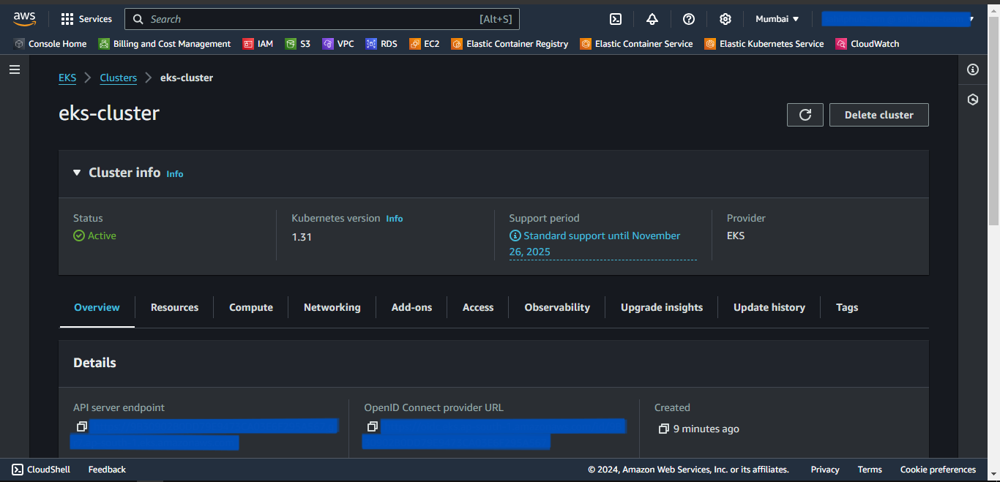
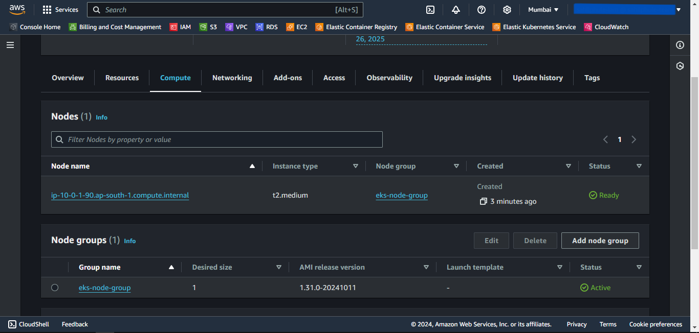
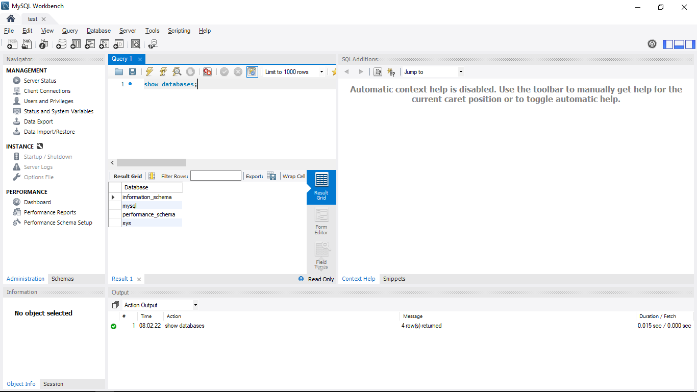

# EKS Provisioning using Pulumi
- We will provision the EKS using Pulumi as an Infrastructure as Code.
- We will deploy it in a custom Virtual Private Cloud for isolation.
- We will also deploy RDS MySQL Instance to store the relational data and connect it to EKS.

---
## Prerequisites
---

1. An AWS account with an IAM user having sufficient permissions.
2. AWS CLI installed and configured with the IAM user.
3. Pulumi Installed.
4. Kubectl Installed.

---
## Write Pulumi Configuration files
---

First, we will initiate and edit Pulumi configuration files for AWS resources using predefined Pulumi Library available on the internet.

## Steps
1. Create a Pulumi Project directory.
2. Open the PowerShell.
3. Change the directory to the above-created Pulumi Project.
4. Run the **`pulumi new aws-python`** command to initialize the *pulumi*.
5. Provide the appropriate values to prompts such as *project-name*, *project-description*, *stack-name*, *toolchain*, *region-name*, etc.
6. This will generate some Pulumi files in this directory.
7. Now we will install predefined Pulumi modules.
8. Activate the **`venv`** by running **`venv\Scripts\activate`**.
9. Run **`pip install git+https://github.com/inflection-sahil/pulumi.git`** to install the modules.
10. Deactivate the **`venv`** by running **`deactivate`**.
11. Now open the directory in the preferred IDE.
12. Create *commons* folder
13. Inside the folder create *__init__.py* file.
14. Import the following in the *__init__.py* file:
    - from inflection_zone_pulumi.modules.aws.vpc import vpc
    - from inflection_zone_pulumi.modules.aws.rds import rds
    - from inflection_zone_pulumi.modules.aws.eks import eks
15. Click [code](https://github.com/inflection-zone/iac-recipes/blob/inflection-sahil/pulumi/aws/eks/commons/__init__.py) for reference.
16. Definition of *__init__.py* is complete.
17. Now create the *values.py* file in the root folder of the above-created project directory.
18. Define the following values:
    - vpc_properties
    - rds_properties
    - bastion_properties
    - eks_properties
19. Click [code](https://github.com/inflection-zone/iac-recipes/blob/inflection-sahil/pulumi/aws/eks/sample.values.py) for reference.
20. The definition of *values.py* is complete.
21. Now navigate to the *__main__.py* file present in the root folder of the above-created project directory.
22. Clear the sample code if present.
23. Import the following:
    - from commons import vpc, rds, eks
    - values
24. Define the following objects and pass the values as an argument:
    - VPC
    - RDS
    - EKS
25. Click [code](https://github.com/inflection-zone/iac-recipes/blob/inflection-sahil/pulumi/aws/eks/__main__.py) for reference.
26. Definition of *__main__.py* is complete.

---
## Provisioning the Infrastructure
---

Now we will provision the infrastructure by applying the above-created configuration files.
> Ensure AWS CLI is configured with appropriate IAM user credentials and enough permissions.

## Steps:
1. Open the PowerShell.
2. Change the directory to the above-created Pulumi Project.
3. Run the **`pulumi up`** command and if prompted, select **`yes`** to provision the infrastructure onto the AWS Cloud.
4. Head to the AWS Console, and verify the created resources.

---
<div style="page-break-after: always;"></div>

## Screenshots of Provisioned Infrastructure
---

### VPC Image


---

### RDS Image


---
<div style="page-break-after: always;"></div>

### EKS Cluster Image


---

### EKS Node Group Image


---
<div style="page-break-after: always;"></div>

### EKS Nodes Image


---
## Connect to EKS Cluster from Powershell
---

## Steps
1. Open a new Powershell window.
2. Run the following command to configure local kubectl with eks cluster  
```sh
aws eks --region <region-name> update-kubeconfig --name <cluster-name>
```
> Substitute <*region-name*> and <*cluster-name*> with the values defined in the above-created *values.py* file.
3. Now, apply the Kubernetes manifest files for the application.
4. To list them all, run **`kubectl get all`**.

---
## Connection to the RDS database through Bastion Host using MySQL Workbench
---

Now, we will use MySQL Workbench to connect and access the MySQL RDS Database through above created Bastion Host.

1. Open MySQL Workbench.
2. Click Add Connection.
3. Select connection method as **Standard TCP/IP over SSH**.
4. In SSH Hostname, enter *bastion-host-ip:22* where bastion-host-ip is received from **`pulumi stack output bastion-host-ip`** command.
5. In SSH Username, enter *ec2-user*.
6. In SSH Key File, select *bastion-key.pem* file passed in above *values.py* file from your local computer.
7. In MySQL Hostname, enter *DB_HOST* where DB_HOST is received from **`pulumi stack output DB_HOST`**.
8. In the Password section, select *Store in Vault*, and enter the password passed in above-created *values.py* file.
9. Click *OK* and open the connection.
10. Now you can run MySQL commands to access databases and verify the successful connection of *eks-nodes*.

---
## Screenshots of MySQL Workbench
---

### Connection Page


---
<div style="page-break-after: always;"></div>

### Commands Page


---
## Destroy the provisioned infrastructure
---

Lastly, we will destroy the above-created resources.

## Steps
1. First, delete all the Kubernetes Deployments.
2. To destroy infrastructure, open the Powershell Window and change the directory to the above-created Pulumi Project using the **`cd`** command.
3. Run **`pulumi destroy`** & if prompted, select **`yes`**.
4. Infrastructure will be destroyed.

---
