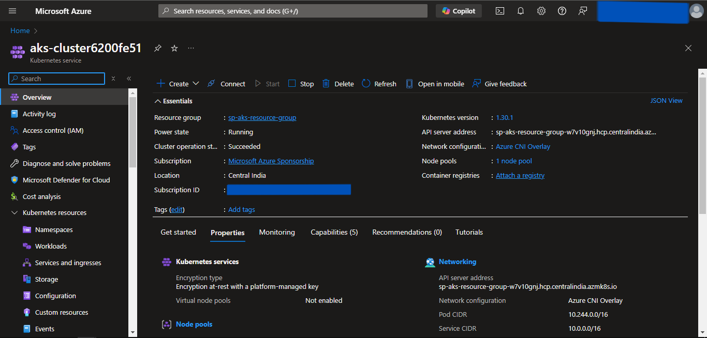

# AKS Provisioning using Pulumi

## Prerequisites
1. An Azure account.
2. Azure CLI installed and configured with the appropriate Azure User or Service Principal.
3. Pulumi Installed.
4. Kubectl Installed.

---
## Steps
1. Create a Pulumi Project directory.
2. Open the PowerShell.
3. Change the directory to the above-created Pulumi Project.
4. Run the **`pulumi new azure-python`** command to initialize the *pulumi*.
5. Provide the appropriate values to prompts such as *project-name*, *project-description*, *stack-name*, *toolchain*, *region-name*, etc.
6. This will generate some Pulumi files in this directory.
7. Now we will install predefined Pulumi modules.
8. Activate the **`venv`** by running **`venv\Scripts\activate`**.
9. Run **`pip install git+https://github.com/sahilphule/pulumi.git`** to install the modules.
10. Deactivate the **`venv`** by running **`deactivate`**.
11. Now open the directory in the preferred IDE.
12. Create *commons* folder
13. Inside the folder create *__init__.py* file.
14. Import the following in the *__init__.py* file:
    - from inflection_zone_pulumi.modules.azure.resource_group import resource_group
    - from inflection_zone_pulumi.modules.azure.vnet import vnet
    - from inflection_zone_pulumi.modules.azure.acr import acr
    - from inflection_zone_pulumi.modules.azure.mysql_flexible import mysql_flexible
    - from inflection_zone_pulumi.modules.azure.aks import aks
15. Click [code](https://github.com/inflection-sahil/devops/blob/master/pulumi/azure/aks/commons/__init__.py) for reference.
16. Definition of *__init__.py* is complete.
17. Now create the *values.py* file in the root folder of the above-created project directory.
18. Define the following values:
    - resource_group_properties
    - vnet_properties
    - acr_properties
    - mysql_flexible_properties
    - aks_properties
19. Click [code](https://github.com/inflection-sahil/devops/blob/master/pulumi/azure/aks/sample.values.py) for reference.
20. The definition of *values.py* is complete.
21. Now navigate to the *__main__.py* file present in the root folder of the above-created project directory.
22. Clear the sample code if present.
23. Import the following:
    - from commons import resource_group, vnet, acr, mysql_flexible, aks
    - values
24. Define the following objects and pass the values & dependencies as an argument:
    - RESOURCE_GROUP
    - VNET
    - ACR
    - MYSQL_FLEXIBLE
    - AKS
25. Click [code](https://github.com/inflection-sahil/devops/blob/master/pulumi/azure/aks/__main__.py) for reference.
26. Definition of *__main__.py* is complete.

---

## Provisioning the Infrastructure
Now we will provision the infrastructure by applying the above-created configuration files.

> Ensure Azure CLI is configured with the appropriate Azure User or Service Principal.

### Steps:
1. Open the PowerShell.
2. Change the directory to the above-created Pulumi Project.
3. Run the **`pulumi up`** command and if prompted, select **`yes`** to provision the infrastructure onto the Azure Cloud.
4. Head to the Azure Console, and verify the created resources.

---

## Screenshots of Provisioned Infrastructure

---

### Resource Group Image

---

### VNet Image

---

### ACR Image

---

### AKS Cluster Image

---

## Connect to the AKS Cluster from Powershell
1. Open a new Powershell window.
2. Run the following commands to configure local kubectl with aks cluster:
    - **`az login`**
    - **`az account set --subscription "subscription-id"`**
    - **`az aks get-credentials --resource-group "resource-group-name" --name "cluster-name" --overwrite-existing`**  
Substitute *subscription-id* which can be found by running **`az account list`** in the *id* field. Also, substitute *resource-group-name* and *cluster-name* with the values defined in the above-created locals.tf file.
3. Now apply the Kubernetes manifest files of the application using the following command:
    - **`kubectl apply -f "file-path"`**  
    Substitute *file-path* with the Kubernetes manifest file path.
4. To list them all, run **`kubectl get all`**.
5. If a Load Balancer type Service is present then try accessing the External IP of that service in the browser.

---

## Destroy the provisioned infrastructure

1. Firstly, delete all the Kubernetes Deployments using:
    - **`kubectl delete -f "file-path"`**  
    Substitute *file-path* with the Kubernetes manifest file path.
2. To destroy infrastructure, change the directory to the above-created Pulumi Project using **`cd`** command.
3. Run **`pulumi destroy`** & if prompted, select **`yes`**.
4. Infrastructure will be destroyed.

---