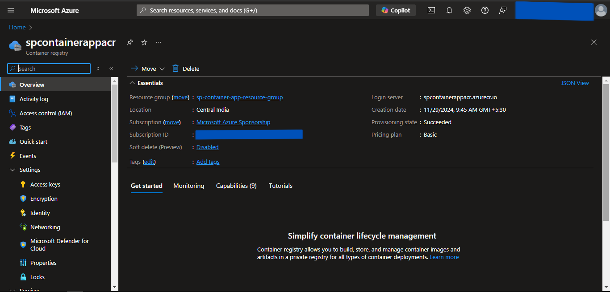
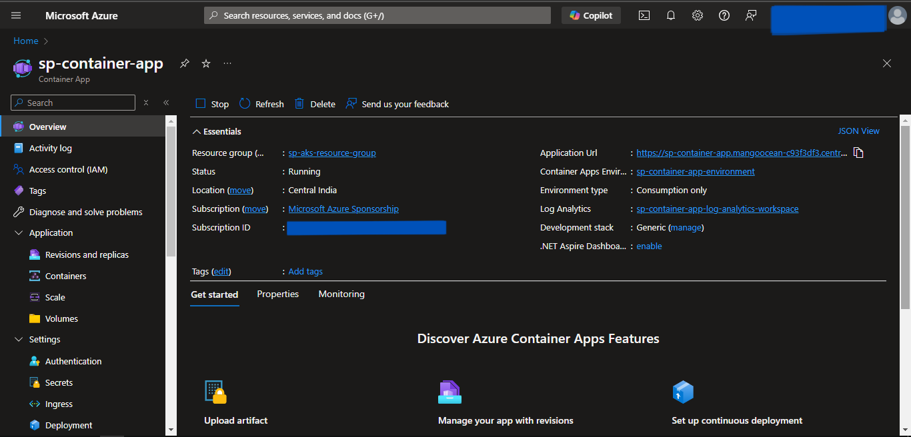

# Container Apps Provisioning using Pulumi
- We will provision the Container App using Pulumi as an Infrastructure as Code.
- We will deploy it in a custom Virtual Network for isolation.
- We will connect the Container App to ACR for Docker Image.
- We will also create a Storage Account Container to store the *.env* file.
- Also will deploy MySQL Flexible to store the relational data and connect it to the Container App.

---
## Prerequisites
---

1. An Azure account.
2. Azure CLI installed and configured with the appropriate Azure User or Service Principal.
3. Pulumi Installed.

---
## Write Pulumi Configuration files
---

First, we will initiate and edit Pulumi configuration files for Azure resources using predefined Pulumi Library available on the internet.

## Steps
1. Create a Pulumi Project directory.
2. Open the PowerShell.
3. Change the directory to the above-created Pulumi Project.
4. Run the **`pulumi new azure-python`** command to initialize the *pulumi*.
5. Provide the appropriate values to prompts such as *project-name*, *project-description*, *stack-name*, *toolchain*, *region-name*, etc.
6. This will generate some Pulumi files in this directory.
7. Now we will install predefined Pulumi modules.
8. Activate the **`venv`** by running **`venv\Scripts\activate`**.
9. Run **`pip install git+https://github.com/inflection-sahil/pulumi.git`** to install the modules.
10. Deactivate the **`venv`** by running **`deactivate`**.
11. Now open the directory in the preferred IDE.
12. Create *commons* folder
13. Inside the folder create *__init__.py* file.
14. Import the following in the *__init__.py* file:
    - from inflection_zone_pulumi.modules.azure.resource_group import resource_group
    - from inflection_zone_pulumi.modules.azure.vnet import vnet
    - from inflection_zone_pulumi.modules.azure.acr import acr
    - from inflection_zone_pulumi.modules.azure.mysql_flexible import mysql_flexible
    - from inflection_zone_pulumi.modules.azure.container_apps import container_app
15. Click [code](https://github.com/inflection-zone/iac-recipes/blob/inflection-sahil/pulumi/azure/container-apps/commons/__init__.py) for reference.
16. Definition of *__init__.py* is complete.
17. Now create the *values.py* file in the root folder of the above-created project directory.
18. Define the following values:
    - resource_group_properties
    - vnet_properties
    - acr_properties
    - mysql_flexible_properties
    - container_app_properties
19. Click [code](https://github.com/inflection-zone/iac-recipes/blob/inflection-sahil/pulumi/azure/container-apps/sample.values.py) for reference.
20. The definition of *values.py* is complete.
21. Now navigate to the *__main__.py* file present in the root folder of the above-created project directory.
22. Clear the sample code if present.
23. Import the following:
    - from commons import resource_group, vnet, acr, mysql_flexible, container_app
    - values
24. Define the following objects and pass the values & dependencies as an argument:
    - RESOURCE_GROUP
    - VNET
    - ACR
    - MYSQL_FLEXIBLE
    - CONTAINER_APP
25. Click [code](https://github.com/inflection-zone/iac-recipes/blob/inflection-sahil/pulumi/azure/container-apps/__main__.py) for reference.
26. Definition of *__main__.py* is complete.

---
## Provisioning the Infrastructure
---

Now we will provision the infrastructure by applying the above-created configuration files.
> Ensure Azure CLI is configured with the appropriate Azure User or Service Principal.

### Steps:
1. Open the PowerShell.
2. Change the directory to the above-created Pulumi Project.
3. Run the **`pulumi up`** command and if prompted, select **`yes`** to provision the infrastructure onto the Azure Cloud.
4. Head to the Azure Console, and verify the created resources.
5. Access the service onto the browser using the url received by running **`pulumi stack output container-app-url`**.

---

---
## Screenshots of Provisioned Infrastructure
---

### Resource Group Image

---

### VNet Image

---

### ACR Image

---

### MySQL Flexible Server Image

---

### Container App Image

---
## Destroy the provisioned infrastructure
---

Lastly, we will destroy the above-created resources.

## Steps
1. To destroy infrastructure, open the Powershell Window and change the directory to the above-created Pulumi Project using the **`cd`** command.
2. Run **`pulumi destroy`** & if prompted, select **`yes`**.
3. Infrastructure will be destroyed.

---
