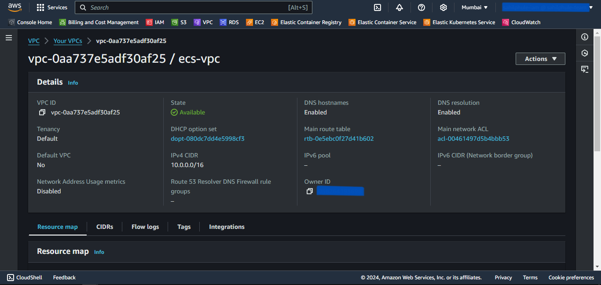
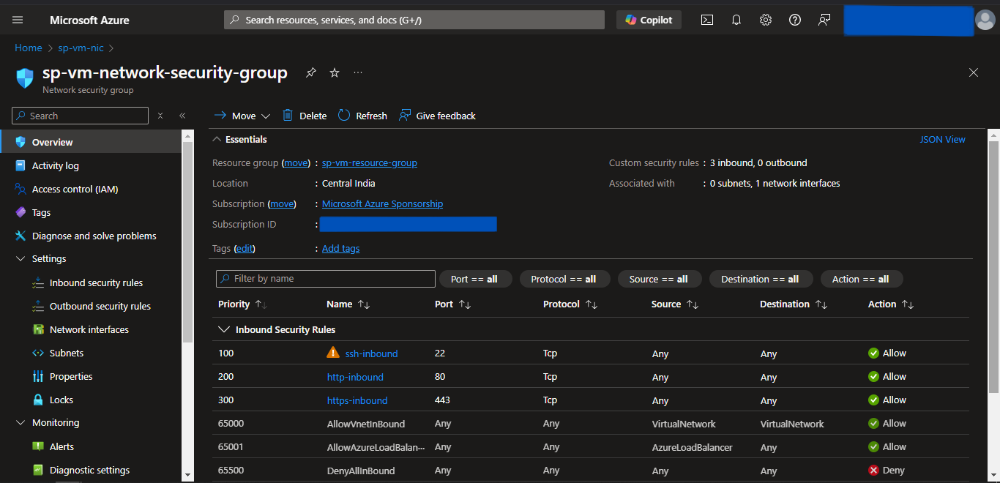
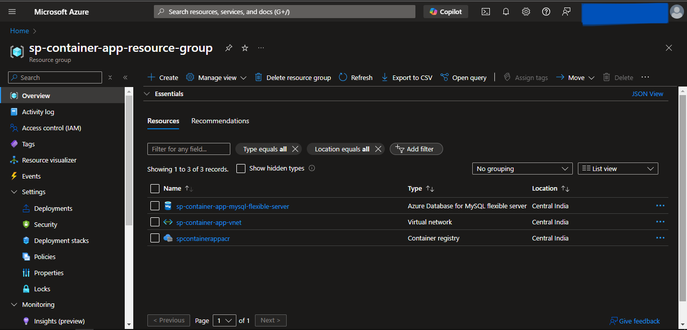
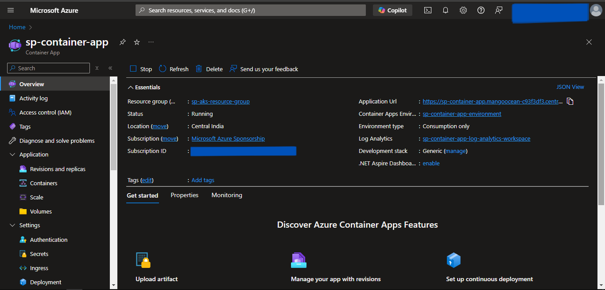

<div style="display: flex; justify-content: center; align-items: center; height: 100vh; text-align: center;">
  <h1 style="font-size: 5em;">Pulumi Cookbook</h1>
</div>

---

## Table of Contents

---

## AWS
1. [ECS Pulumi](#ecs-provisioning-using-pulumi)_ _ _ _ _ _ _ _ _ _ _ _ _ _ _ _ _ _ _ _ _ _ _ _ _ _ _ _ _ _ _ _ _ _ _ _ _ _ _ _ _ _ _ _ _ _ _ _ _ _ _ _ _ _ _ _ _ _ 3
2. [EKS Pulumi](#eks-provisioning-using-pulumi)_ _ _ _ _ _ _ _ _ _ _ _ _ _ _ _ _ _ _ _ _ _ _ _ _ _ _ _ _ _ _ _ _ _ _ _ _ _ _ _ _ _ _ _ _ _ _ _ _ _ _ _ _ _ _ _ _ _10

---

## Azure
1. [Virtual Machine Pulumi](#azure-virtual-machine-provisioning-using-pulumi)_ _ _ _ _ _ _ _ _ _ _ _ _ _ _ _ _ _ _ _ _ _ _ _ _ _ _ _ _ _ _ _ _ _ _ _ _ _ _ _ _ _ _ _ _ _ _ _ _ _17
2. [Container Apps Pulumi](#container-apps-provisioning-using-pulumi)_ _ _ _ _ _ _ _ _ _ _ _ _ _ _ _ _ _ _ _ _ _ _ _ _ _ _ _ _ _ _ _ _ _ _ _ _ _ _ _ _ _ _ _ _ _ _ _ _ _24
3. [AKS Pulumi](#aks-provisioning-using-pulumi)_ _ _ _ _ _ _ _ _ _ _ _ _ _ _ _ _ _ _ _ _ _ _ _ _ _ _ _ _ _ _ _ _ _ _ _ _ _ _ _ _ _ _ _ _ _ _ _ _ _ _ _ _ _ _ _ _ 29

---
<div style="page-break-after: always;"></div>

---

# ECS Provisioning using Pulumi
- We will provision the ECS using Pulumi as an Infrastructure as Code.
- We will deploy it in a custom Virtual Private Cloud for isolation.
- We will connect the Container App to ECR for Docker Image.
- We will also create S3 bucket to store the *.env* file.
- Also will deploy RDS MySQL Instance to store the relational data and connect it to ECS.

---
## Prerequisites
---

1. An AWS account with an IAM user having sufficient permissions.
2. AWS CLI installed and configured with the IAM user.
3. Pulumi Installed.

---
## Write Pulumi Configuration files
---

First, we will initiate and edit Pulumi configuration files for AWS resources using predefined Pulumi Library available on the internet.

## Steps
1. Create a Pulumi Project directory.
2. Open the PowerShell.
3. Change the directory to the above-created Pulumi Project.
4. Run the **`pulumi new aws-python`** command to initialize the *pulumi*.
5. Provide the appropriate values to prompts such as *project-name*, *project-description*, *stack-name*, *toolchain*, *region-name*, etc.
6. This will generate some Pulumi files in this directory.
7. Now we will install predefined Pulumi modules.
8. Activate the **`venv`** by running **`venv\Scripts\activate`**.
9. Run **`pip install git+https://github.com/sahilphule/pulumi.git`** to install the modules.
10. Deactivate the **`venv`** by running **`deactivate`**.
11. Now open the directory in the preferred IDE.
12. Create *commons* folder
13. Inside the folder create *__init__.py* file.
14. Import the following in the *__init__.py* file:
    - from inflection_zone_pulumi.modules.aws.vpc import vpc
    - from inflection_zone_pulumi.modules.aws.s3 import s3
    - from inflection_zone_pulumi.modules.aws.rds import rds
    - from inflection_zone_pulumi.modules.aws.load_balancer import load_balancer
    - from inflection_zone_pulumi.modules.aws.ecs import ecs
15. Click [code](https://github.com/inflection-zone/iac-recipes/blob/inflection-sahil/pulumi/aws/ecs/commons/__init__.py) for reference.
16. Definition of *__init__.py* is complete.
17. Now create the *values.py* file in the root folder of the above-created project directory.
18. Define the following values:
    - vpc_properties
    - s3_properties
    - rds_properties
    - bastion_properties
    - ecs_properties
    - ecs_container_definition
    - load_balancer_properties
19. Click [code](https://github.com/inflection-zone/iac-recipes/blob/inflection-sahil/pulumi/aws/ecs/sample.values.py) for reference.
20. The definition of *values.py* is complete.
21. Now navigate to the *__main__.py* file present in the root folder of the above-created project directory.
22. Clear the sample code if present.
23. Import the following:
    - pulumi
    - pulumi_aws as aws
    - from commons import vpc, s3, rds, load_balancer, ecs
    - values
24. Define the following objects and pass the values as an argument:
    - VPC
    - S3
    - RDS
    - Load_balancer
    - ECS
    - bucket_object
25. Click [code](https://github.com/inflection-zone/iac-recipes/blob/inflection-sahil/pulumi/aws/ecs/__main__.py) for reference.
26. Definition of *__main__.py* is complete.

---
## Provisioning the Infrastructure
---

Now we will provision the infrastructure by applying the above-created configuration files.
> Ensure AWS CLI is configured with appropriate IAM user credentials and enough permissions.

### Steps:
1. Open the PowerShell.
2. Change the directory to the above-created Pulumi Project.
3. Run the **`pulumi up`** command and if prompted, select **`yes`** to provision the infrastructure onto the AWS Cloud.
4. Head to the AWS Console, and verify the created resources.
5. Access the service onto the browser using the load balancer url received by running **`pulumi stack output url`**.

---
<div style="page-break-after: always;"></div>

---
## Screenshots of Provisioned Infrastructure
---

### VPC Image


---

### S3 Image


---
<div style="page-break-after: always;"></div>

### RDS Image


---

### LB Image


---
<div style="page-break-after: always;"></div>

### ECS Image


---
## Connection to the RDS database through Bastion Host using MySQL Workbench
---

Now, we will use MySQL Workbench to connect and access the MySQL RDS Database through above created Bastion Host.

1. Open MySQL Workbench.
2. Click Add Connection.
3. Select connection method as **Standard TCP/IP over SSH**.
4. In SSH Hostname, enter *bastion-host-ip:22* where bastion-host-ip is received from **`pulumi stack output bastion-host-ip`** command.
5. In SSH Username, enter *ec2-user*.
6. In SSH Key File, select *bastion-key.pem* file passed in above *values.py* file from your local computer.
7. In MySQL Hostname, enter *DB_HOST* where DB_HOST is received from **`pulumi stack output DB_HOST`**.
8. In the Password section, select *Store in Vault*, and enter the password passed in above-created *values.py* file.
9. Click *OK* and open the connection.
10. Now you can run MySQL commands to access databases and verify the successful connection of *ecs-service*.

---
<div style="page-break-after: always;"></div>

---
## Screenshots of MySQL Workbench
---

### Connection Page


---

### Commands Page


---
<div style="page-break-after: always;"></div>

---
## Destroy the provisioned infrastructure
---

Lastly, we will destroy the above-created resources.

## Steps
1. To destroy infrastructure, open the Powershell Window and change the directory to the above-created Pulumi Project using the **`cd`** command.
2. Run **`pulumi destroy`** & if prompted, select **`yes`**.
3. Infrastructure will be destroyed.

---


<div style="page-break-after: always;"></div>


# EKS Provisioning using Pulumi
- We will provision the EKS using Pulumi as an Infrastructure as Code.
- We will deploy it in a custom Virtual Private Cloud for isolation.
- We will also deploy RDS MySQL Instance to store the relational data and connect it to EKS.

---
## Prerequisites
---

1. An AWS account with an IAM user having sufficient permissions.
2. AWS CLI installed and configured with the IAM user.
3. Pulumi Installed.
4. Kubectl Installed.

---
## Write Pulumi Configuration files
---

First, we will initiate and edit Pulumi configuration files for AWS resources using predefined Pulumi Library available on the internet.

## Steps
1. Create a Pulumi Project directory.
2. Open the PowerShell.
3. Change the directory to the above-created Pulumi Project.
4. Run the **`pulumi new aws-python`** command to initialize the *pulumi*.
5. Provide the appropriate values to prompts such as *project-name*, *project-description*, *stack-name*, *toolchain*, *region-name*, etc.
6. This will generate some Pulumi files in this directory.
7. Now we will install predefined Pulumi modules.
8. Activate the **`venv`** by running **`venv\Scripts\activate`**.
9. Run **`pip install git+https://github.com/sahilphule/pulumi.git`** to install the modules.
10. Deactivate the **`venv`** by running **`deactivate`**.
11. Now open the directory in the preferred IDE.
12. Create *commons* folder
13. Inside the folder create *__init__.py* file.
14. Import the following in the *__init__.py* file:
    - from inflection_zone_pulumi.modules.aws.vpc import vpc
    - from inflection_zone_pulumi.modules.aws.rds import rds
    - from inflection_zone_pulumi.modules.aws.eks import eks
15. Click [code](https://github.com/inflection-zone/iac-recipes/blob/inflection-sahil/pulumi/aws/eks/commons/__init__.py) for reference.
16. Definition of *__init__.py* is complete.
17. Now create the *values.py* file in the root folder of the above-created project directory.
18. Define the following values:
    - vpc_properties
    - rds_properties
    - bastion_properties
    - eks_properties
19. Click [code](https://github.com/inflection-zone/iac-recipes/blob/inflection-sahil/pulumi/aws/eks/sample.values.py) for reference.
20. The definition of *values.py* is complete.
21. Now navigate to the *__main__.py* file present in the root folder of the above-created project directory.
22. Clear the sample code if present.
23. Import the following:
    - from commons import vpc, rds, eks
    - values
24. Define the following objects and pass the values as an argument:
    - VPC
    - RDS
    - EKS
25. Click [code](https://github.com/inflection-zone/iac-recipes/blob/inflection-sahil/pulumi/aws/eks/__main__.py) for reference.
26. Definition of *__main__.py* is complete.

---
## Provisioning the Infrastructure
---

Now we will provision the infrastructure by applying the above-created configuration files.
> Ensure AWS CLI is configured with appropriate IAM user credentials and enough permissions.

## Steps:
1. Open the PowerShell.
2. Change the directory to the above-created Pulumi Project.
3. Run the **`pulumi up`** command and if prompted, select **`yes`** to provision the infrastructure onto the AWS Cloud.
4. Head to the AWS Console, and verify the created resources.

---
<div style="page-break-after: always;"></div>

## Screenshots of Provisioned Infrastructure
---

### VPC Image


---

### RDS Image


---
<div style="page-break-after: always;"></div>

### EKS Cluster Image


---

### EKS Node Group Image


---
<div style="page-break-after: always;"></div>

### EKS Nodes Image


---
## Connect to EKS Cluster from Powershell
---

## Steps
1. Open a new Powershell window.
2. Run the following command to configure local kubectl with eks cluster  
```sh
aws eks --region <region-name> update-kubeconfig --name <cluster-name>
```
> Substitute <*region-name*> and <*cluster-name*> with the values defined in the above-created *values.py* file.
3. Now, apply the Kubernetes manifest files for the application.
4. To list them all, run **`kubectl get all`**.

---
## Connection to the RDS database through Bastion Host using MySQL Workbench
---

Now, we will use MySQL Workbench to connect and access the MySQL RDS Database through above created Bastion Host.

1. Open MySQL Workbench.
2. Click Add Connection.
3. Select connection method as **Standard TCP/IP over SSH**.
4. In SSH Hostname, enter *bastion-host-ip:22* where bastion-host-ip is received from **`pulumi stack output bastion-host-ip`** command.
5. In SSH Username, enter *ec2-user*.
6. In SSH Key File, select *bastion-key.pem* file passed in above *values.py* file from your local computer.
7. In MySQL Hostname, enter *DB_HOST* where DB_HOST is received from **`pulumi stack output DB_HOST`**.
8. In the Password section, select *Store in Vault*, and enter the password passed in above-created *values.py* file.
9. Click *OK* and open the connection.
10. Now you can run MySQL commands to access databases and verify the successful connection of *eks-nodes*.

---
## Screenshots of MySQL Workbench
---

### Connection Page


---
<div style="page-break-after: always;"></div>

### Commands Page


---
## Destroy the provisioned infrastructure
---

Lastly, we will destroy the above-created resources.

## Steps
1. First, delete all the Kubernetes Deployments.
2. To destroy infrastructure, open the Powershell Window and change the directory to the above-created Pulumi Project using the **`cd`** command.
3. Run **`pulumi destroy`** & if prompted, select **`yes`**.
4. Infrastructure will be destroyed.

---


<div style="page-break-after: always;"></div>


# Azure Virtual Machine Provisioning using Pulumi
- We will provision the Azure Virtual Machine using Pulumi as an Infrastructure as Code.
- We will deploy it in a custom Virtual Network for isolation.
- We will SSH into the Virtual Machine, and install the docker.
- Then, we will deploy the Nginx Container and try accessing it on the Web Browser.

---
## Prerequisites
---

1. An Azure account.
2. Azure CLI installed and configured with the appropriate Azure User or Service Principal.
3. Pulumi Installed.
4. Kubectl Installed.

---
## Write Pulumi Configuration files
---

First, we will initiate and edit Pulumi configuration files for Azure resources using predefined Pulumi Library available on the internet.

## Steps
1. Create a Pulumi Project directory.
2. Open the PowerShell.
3. Change the directory to the above-created Pulumi Project.
4. Run the **`pulumi new azure-python`** command to initialize the *pulumi*.
5. Provide the appropriate values to prompts such as *project-name*, *project-description*, *stack-name*, *toolchain*, *region-name*, etc.
6. This will generate some Pulumi files in this directory.
7. Now we will install predefined Pulumi modules.
8. Activate the **`venv`** by running **`venv\Scripts\activate`**.
9. Run **`pip install git+https://github.com/sahilphule/pulumi.git`** to install the modules.
10. Deactivate the **`venv`** by running **`deactivate`**.
11. Now open the directory in the preferred IDE.
12. Create *commons* folder
13. Inside the folder create *__init__.py* file.
14. Import the following in the *__init__.py* file:
    - from inflection_zone_pulumi.modules.azure.resource_group import resource_group
    - from inflection_zone_pulumi.modules.azure.vnet import vnet
    - from inflection_zone_pulumi.modules.azure.virtual_machine import virtual_machine
\15. Click [code](https://github.com/inflection-zone/iac-recipes/blob/inflection-sahil/pulumi/azure/virtual-machine/commons/__init__.py) for reference.
16. Definition of *__init__.py* is complete.
17. Now create the *values.py* file in the root folder of the above-created project directory.
18. Define the following values:
    - resource_group_properties
    - vnet_properties
    - virtual_machine_properties
19. Click [code](https://github.com/inflection-zone/iac-recipes/blob/inflection-sahil/pulumi/azure/virtual-machine/sample.values.py) for reference.
20. The definition of *values.py* is complete.
21. Now navigate to the *__main__.py* file present in the root folder of the above-created project directory.
22. Clear the sample code if present.
23. Import the following:
    - from commons import resource_group, vnet, virtual_machine
    - values
24. Define the following objects and pass the values & dependencies as an argument:
    - RESOURCE_GROUP
    - VNET
    - VM
25. Click [code](https://github.com/inflection-zone/iac-recipes/blob/inflection-sahil/pulumi/azure/virtual-machine/__main__.py) for reference.
26. Definition of *__main__.py* is complete.

---
## Provisioning the Infrastructure
---

Now we will provision the infrastructure by applying the above-created configuration files.
> Ensure Azure CLI is configured with the appropriate Azure User or Service Principal.

## Steps:
1. Open the PowerShell.
2. Change the directory to the above-created Pulumi Project.
3. Run the **`pulumi up`** command and if prompted, select **`yes`** to provision the infrastructure onto the Azure Cloud.
4. Head to the Azure Console, and verify the created resources.

---
<div style="page-break-after: always;"></div>

---
## Screenshots of Provisioned Infrastructure
---

### Resource Group Image


---

### VNet Image


---
<div style="page-break-after: always;"></div>

### Public IP Image


---

### Network Interface Card Image


---
<div style="page-break-after: always;"></div>

### Network Security Group Image


---

### Virtual Machine Image


---
<div style="page-break-after: always;"></div>

---
## SSH Into Azure VM
---

Now we will SSH into the Azure VM and configure it for Nginx container deployment.

## Steps
1. Open the Powershell Window.
2. Run the following command to SSH into Azure VM and substitute the <*admin-username*> with the value provided in *values.py* file under <*virtual_machine_properties*> section and <*vm-public-ip*> with the Azure VM Public IP received from **`pulumi stack output vm-public-ip`** command:
```sh
    ssh -o StrictHostKeyChecking=no <admin-username>@<vm-public-ip>
```
3. It will promt for password, enter the <*admin-password*> provided in the *values.py* file under <*virtual_machine_properties*> section.
4. Once you enter the server, run the following commands to install the necessary dependencies for deployment and run the nginx container:
```sh
    sudo apt update
    sudo apt install -y docker.io
    sudo docker run -d -p 80:80 nginx
```
9. Try accessing it on the browser using <*vm-public-ip*> received from **`pulumi stack output vm-public-ip`** command.

### Nginx Image


---
<div style="page-break-after: always;"></div>

---
## Destroy the provisioned infrastructure
---

Lastly, we will destroy the above-created resources.

## Steps
1. To destroy infrastructure, open the Powershell Window and change the directory to the above-created Pulumi Project using the **`cd`** command.
2. Run **`pulumi destroy`** & if prompted, select **`yes`**.
3. Infrastructure will be destroyed.

---


<div style="page-break-after: always;"></div>


# Container Apps Provisioning using Pulumi
- We will provision the Container App using Pulumi as an Infrastructure as Code.
- We will deploy it in a custom Virtual Network for isolation.
- We will connect the Container App to ACR for Docker Image.
- We will also create a Storage Account Container to store the *.env* file.
- Also will deploy MySQL Flexible to store the relational data and connect it to the Container App.

---
## Prerequisites
---

1. An Azure account.
2. Azure CLI installed and configured with the appropriate Azure User or Service Principal.
3. Pulumi Installed.

---
## Write Pulumi Configuration files
---

First, we will initiate and edit Pulumi configuration files for Azure resources using predefined Pulumi Library available on the internet.

## Steps
1. Create a Pulumi Project directory.
2. Open the PowerShell.
3. Change the directory to the above-created Pulumi Project.
4. Run the **`pulumi new azure-python`** command to initialize the *pulumi*.
5. Provide the appropriate values to prompts such as *project-name*, *project-description*, *stack-name*, *toolchain*, *region-name*, etc.
6. This will generate some Pulumi files in this directory.
7. Now we will install predefined Pulumi modules.
8. Activate the **`venv`** by running **`venv\Scripts\activate`**.
9. Run **`pip install git+https://github.com/sahilphule/pulumi.git`** to install the modules.
10. Deactivate the **`venv`** by running **`deactivate`**.
11. Now open the directory in the preferred IDE.
12. Create *commons* folder
13. Inside the folder create *__init__.py* file.
14. Import the following in the *__init__.py* file:
    - from inflection_zone_pulumi.modules.azure.resource_group import resource_group
    - from inflection_zone_pulumi.modules.azure.vnet import vnet
    - from inflection_zone_pulumi.modules.azure.acr import acr
    - from inflection_zone_pulumi.modules.azure.mysql_flexible import mysql_flexible
    - from inflection_zone_pulumi.modules.azure.container_apps import container_app
15. Click [code](https://github.com/inflection-zone/iac-recipes/blob/inflection-sahil/pulumi/azure/container-apps/commons/__init__.py) for reference.
16. Definition of *__init__.py* is complete.
17. Now create the *values.py* file in the root folder of the above-created project directory.
18. Define the following values:
    - resource_group_properties
    - vnet_properties
    - acr_properties
    - mysql_flexible_properties
    - container_app_properties
19. Click [code](https://github.com/inflection-zone/iac-recipes/blob/inflection-sahil/pulumi/azure/container-apps/sample.values.py) for reference.
20. The definition of *values.py* is complete.
21. Now navigate to the *__main__.py* file present in the root folder of the above-created project directory.
22. Clear the sample code if present.
23. Import the following:
    - from commons import resource_group, vnet, acr, mysql_flexible, container_app
    - values
24. Define the following objects and pass the values & dependencies as an argument:
    - RESOURCE_GROUP
    - VNET
    - ACR
    - MYSQL_FLEXIBLE
    - CONTAINER_APP
25. Click [code](https://github.com/inflection-zone/iac-recipes/blob/inflection-sahil/pulumi/azure/container-apps/__main__.py) for reference.
26. Definition of *__main__.py* is complete.

---
## Provisioning the Infrastructure
---

Now we will provision the infrastructure by applying the above-created configuration files.
> Ensure Azure CLI is configured with the appropriate Azure User or Service Principal.

### Steps:
1. Open the PowerShell.
2. Change the directory to the above-created Pulumi Project.
3. Run the **`pulumi up`** command and if prompted, select **`yes`** to provision the infrastructure onto the Azure Cloud.
4. Head to the Azure Console, and verify the created resources.
5. Access the service onto the browser using the url received by running **`pulumi stack output container-app-url`**.

---
<div style="page-break-after: always;"></div>

---
## Screenshots of Provisioned Infrastructure
---

### Resource Group Image


---

### VNet Image


---
<div style="page-break-after: always;"></div>

### ACR Image


---

### MySQL Flexible Server Image


---
<div style="page-break-after: always;"></div>

### Container App Image


---
## Destroy the provisioned infrastructure
---

Lastly, we will destroy the above-created resources.

## Steps
1. To destroy infrastructure, open the Powershell Window and change the directory to the above-created Pulumi Project using the **`cd`** command.
2. Run **`pulumi destroy`** & if prompted, select **`yes`**.
3. Infrastructure will be destroyed.

---


<div style="page-break-after: always;"></div>


# AKS Provisioning using Pulumi
- We will provision the AKS using Pulumi as an Infrastructure as Code.
- We will deploy it in a custom Virtual Network for isolation.
- We will connect the AKS to ACR for Docker Image.
- We will also deploy MySQL Flexible to store the relational data and connect it to AKS.

---
## Prerequisites
---

1. An Azure account.
2. Azure CLI installed and configured with the appropriate Azure User or Service Principal.
3. Pulumi Installed.
4. Kubectl Installed.

---
## Write Pulumi Configuration files
---

First, we will initiate and edit Pulumi configuration files for Azure resources using predefined Pulumi Library available on the internet.

## Steps
1. Create a Pulumi Project directory.
2. Open the PowerShell.
3. Change the directory to the above-created Pulumi Project.
4. Run the **`pulumi new azure-python`** command to initialize the *pulumi*.
5. Provide the appropriate values to prompts such as *project-name*, *project-description*, *stack-name*, *toolchain*, *region-name*, etc.
6. This will generate some Pulumi files in this directory.
7. Now we will install predefined Pulumi modules.
8. Activate the **`venv`** by running **`venv\Scripts\activate`**.
9. Run **`pip install git+https://github.com/sahilphule/pulumi.git`** to install the modules.
10. Deactivate the **`venv`** by running **`deactivate`**.
11. Now open the directory in the preferred IDE.
12. Create *commons* folder
13. Inside the folder create *__init__.py* file.
14. Import the following in the *__init__.py* file:
    - from inflection_zone_pulumi.modules.azure.resource_group import resource_group
    - from inflection_zone_pulumi.modules.azure.vnet import vnet
    - from inflection_zone_pulumi.modules.azure.acr import acr
    - from inflection_zone_pulumi.modules.azure.mysql_flexible import mysql_flexible
    - from inflection_zone_pulumi.modules.azure.aks import aks
15. Click [code](https://github.com/inflection-zone/iac-recipes/blob/inflection-sahil/pulumi/azure/aks/commons/__init__.py) for reference.
16. Definition of *__init__.py* is complete.
17. Now create the *values.py* file in the root folder of the above-created project directory.
18. Define the following values:
    - resource_group_properties
    - vnet_properties
    - acr_properties
    - mysql_flexible_properties
    - aks_properties
19. Click [code](https://github.com/inflection-zone/iac-recipes/blob/inflection-sahil/pulumi/azure/aks/sample.values.py) for reference.
20. The definition of *values.py* is complete.
21. Now navigate to the *__main__.py* file present in the root folder of the above-created project directory.
22. Clear the sample code if present.
23. Import the following:
    - from commons import resource_group, vnet, acr, mysql_flexible, aks
    - values
24. Define the following objects and pass the values & dependencies as an argument:
    - RESOURCE_GROUP
    - VNET
    - ACR
    - MYSQL_FLEXIBLE
    - AKS
25. Click [code](https://github.com/inflection-zone/iac-recipes/blob/inflection-sahil/pulumi/azure/aks/__main__.py) for reference.
26. Definition of *__main__.py* is complete.

---
## Provisioning the Infrastructure
---

Now we will provision the infrastructure by applying the above-created configuration files.
> Ensure Azure CLI is configured with the appropriate Azure User or Service Principal.

## Steps:
1. Open the PowerShell.
2. Change the directory to the above-created Pulumi Project.
3. Run the **`pulumi up`** command and if prompted, select **`yes`** to provision the infrastructure onto the Azure Cloud.
4. Head to the Azure Console, and verify the created resources.

---
<div style="page-break-after: always;"></div>

---
## Screenshots of Provisioned Infrastructure
---

### Resource Group Image


---

### VNet Image


---
<div style="page-break-after: always;"></div>

### ACR Image


---

### MySQL Flexible Server Image


---
<div style="page-break-after: always;"></div>

### AKS Cluster Image


---
## Connect to the AKS Cluster from Powershell
---

## Steps
1. Open a new Powershell window.
2. Run the following commands to configure local kubectl with aks cluster:
```sh
az login
az account set --subscription <subscription-id>
az aks get-credentials --resource-group <resource-group-name> --name <cluster-name> --overwrite-existing
```
> Substitute <*subscription-id*> which can be found by running **`az account list`** in the *id* field. Also, substitute <*resource-group-name*> and <*cluster-name*> with the values defined in the above-created *values.py* file.
3. Now apply the Kubernetes manifest files of the application using the following command:
```sh
kubectl apply -f <file-path>
```
> Substitute <*file-path*> with the Kubernetes manifest file path.
4. To list them all, run **`kubectl get all`**.
5. If a Load Balancer type Service is present then try accessing the External IP of that service in the browser.

---
## Destroy the provisioned infrastructure
---

Lastly, we will destroy the above-created resources.

## Steps
1. Firstly, delete all the Kubernetes Deployments using:
    - **`kubectl delete -f "file-path"`**  
    Substitute *file-path* with the Kubernetes manifest file path.
2. To destroy infrastructure, open the Powershell Window and change the directory to the above-created Pulumi Project using the **`cd`** command.
3. Run **`pulumi destroy`** & if prompted, select **`yes`**.
4. Infrastructure will be destroyed.

---
