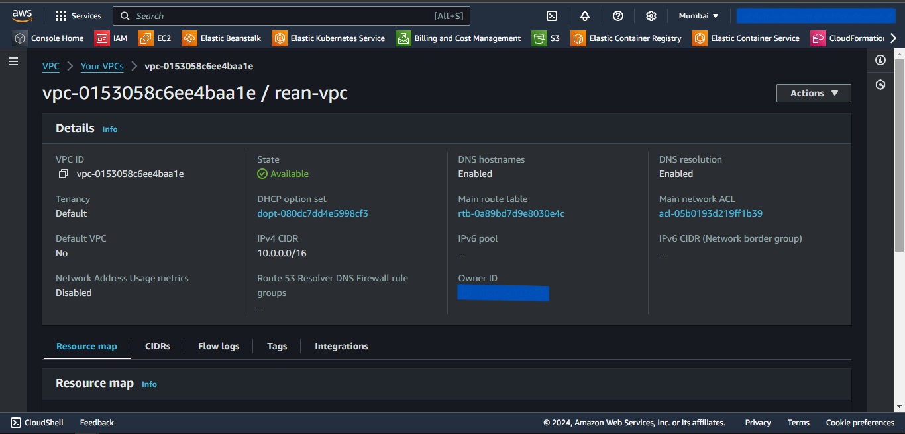
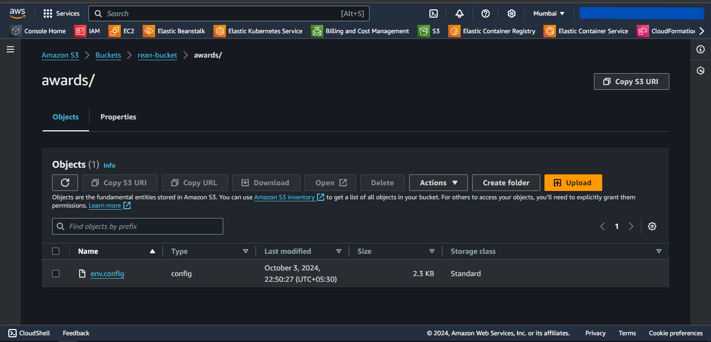
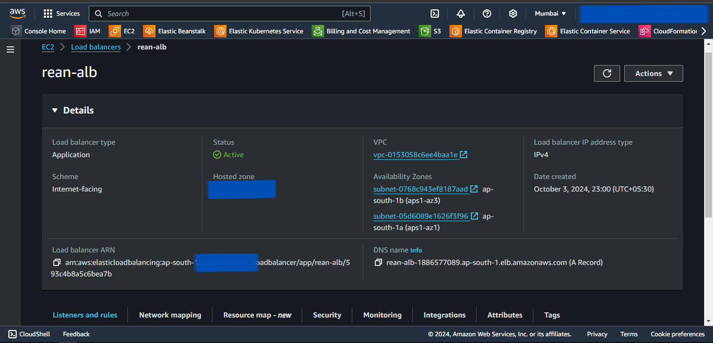
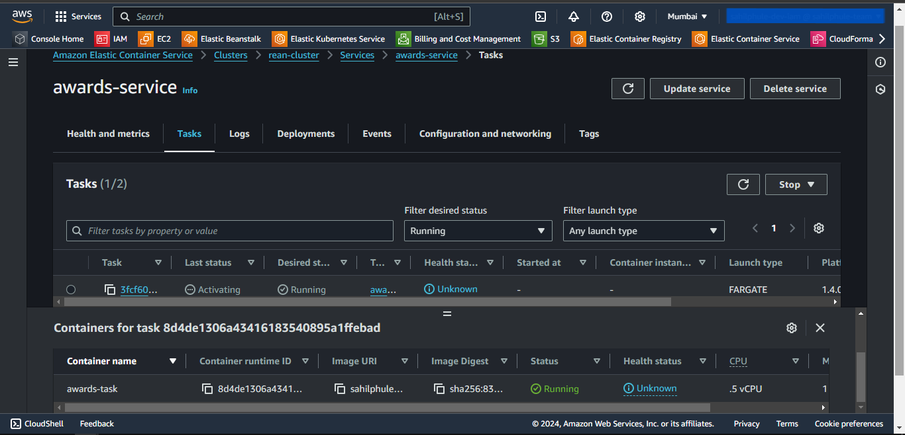

# ECS Provisioning using Terraform
- We will provision the ECS using Terraform as an Infrastructure as Code.
- We will deploy it in a custom Virtual Private Cloud for isolation.
- We will connect the Container App to ECR for Docker Image.
- We will also create S3 bucket to store the *.env* file.
- Also will deploy RDS MySQL Instance to store the relational data and connect it to ECS.

---
## Prerequisites
---

1. AWS Account with an IAM User with administrative permissions.
2. Terraform installed.

---
## Write Terraform Configuration files
---

First, we will write Terraform configuration files for AWS resources using predefined modules available on the internet.

## Steps
1. Create the **ecs-terraform** directory.
2. The folder structure for the above-created directory is as follows:
```
ecs-terraform
│───.terraform.lock.hcl
│───locals.tf
│───main.tf
│───outputs.tf
│───providers.tf
│───terraform.tfstate
│───terraform.tfstate.backup
└───.terraform
```

> We need to only create *providers.tf*, *main.tf*, *outputs.tf*, & *locals.tf* file. Other files are generated while initiating terraform.

3. Create a *providers.tf* file inside the above-created directory.
4. Inside it, define the following:
    - terraform
      - required_providers
    - provider
      - docker
      - aws
5. Click [code](https://github.com/inflection-zone/iac-recipes/blob/inflection-sahil/terraform/aws/ecs/providers.tf) for reference.
6. The definition of *providers.tf* file is complete.
7. Now, create the *main.tf* file.
8. Inside *main.tf* file, we will use the following predefined modules:
    - module.vpc
    - module.s3
    - module.rds
    - module.ecr
    - module.load-balancer
    - module.ecs
9. Also define the following s3 resource for uploading local .env file:
    - resource.aws_s3_object
10. Click [code](https://github.com/inflection-zone/iac-recipes/blob/inflection-sahil/terraform/aws/ecs/main.tf) for reference.
11. The definition of *main.tf* file is complete.
12. Now we will create *outputs.tf* file.
13. Inside it, define the following outputs.
    - output.DB_HOST
    - output.bastion-host-ip
14. Click [code](https://github.com/inflection-zone/iac-recipes/blob/inflection-sahil/terraform/aws/ecs/outputs.tf) for reference.
15. The definition of *outputs.tf* file is complete.
16. Now we will create *locals.tf* file.
17. Inside it, define the following variables:
    - local.vpc-properties
    - local.s3-properties
    - local.database-properties
    - local.bastion-properties
    - local.load-balancer-properties
    - local.ecs-properties
18. Click [code](https://github.com/inflection-zone/iac-recipes/blob/inflection-sahil/terraform/aws/ecs/sample-locals.txt) for reference.
19. The definition of *locals.tf* file is complete.

> Ensure you give the appropriate values to the variables defined in *locals.tf* file.  
> Also, update the *s3-object-source-path* variable under *s3-properties* with local *.env* file relative path.

---

## Provisioning the Infrastructure

---

Now we will provision the AWS infrastructure by applying the above-created configuration files.
> Ensure AWS CLI is configured with appropriate AWS user credentials and enough permissions.

## Steps:
1. Open the PowerShell.
2. Change the directory to the above-created **ecs-terraform** directory using **`cd`** command.
3. Run the **`terraform fmt -recursive`** command to format the syntax of the files.
4. Run the **`terraform init`** command to initialize the *terraform*.
5. Run the **`terraform validate`** command to validate the configuration files.
6. Run the **`terraform plan`** command to plan the resources to be created.
7. Run the **`terraform apply`** command and if prompted, type **`yes`** to provision the infrastructure.
8. Run the **`terraform output`** command to get the values of defined variables in *outputs.tf* file.
9. Head to the AWS Console, and verify the created resources.
10. Then,
    - Head towards EC2 dashboard.
    - Select *Load Balancers*, and select the created load balancer.
    - Copy the DNS address.
    - Paste the address in the browser to access the application.

---

## Screenshots of Provisioned Infrastructure

---

### VPC Image


---

<div style="page-break-after: always;"></div>

### S3 Image


---

### RDS Image


---

<div style="page-break-after: always;"></div>

### ALB Image


---

### ECS Image


---

<div style="page-break-after: always;"></div>

---
## Connection to the RDS database through Bastion Host using MySQL Workbench
---

Now, we will use MySQL Workbench to connect and access the MySQL RDS Database through above created Bastion Host.

## Steps
1. Open MySQL Workbench.
2. Click Add Connection.
3. Select connection method as **Standard TCP/IP over SSH**.
4. In SSH Hostname, enter *bastion-host-ip:22* where bastion-host-ip is received from the **`terraform output`** command.
5. In SSH Username, enter *ec2-user*.
6. In SSH Key File, select *bastion-key.pem* file passed in above *locals.tf* file from your local computer.
7. In MySQL Hostname, enter *DB_HOST* where DB_HOST is received from the **`terraform output`** command.
8. In the Password section, select *Store in Vault*, and enter the password passed in above-created *locals.tf* file.
9. Click *OK* and open the connection.
10. Now you can run MySQL commands to access databases and verify the successful connection of *ecs-container*.

---
<div style="page-break-after: always;"></div>

---
## Screenshots of MySQL Workbench
---

### Connection Page


---

### Commands Page


---
<div style="page-break-after: always;"></div>

---
## Destroy the provisioned infrastructure
---

Lastly, we will destroy the above-created resources.

## Steps
1. To destroy infrastructure, open the Powershell Window and change the directory to the above-created **ecs-terraform** directory using the **`cd`** command.
2. Run **`terraform destroy`** & if prompted, type **`yes`**.
3. Infrastructure will be destroyed.

---