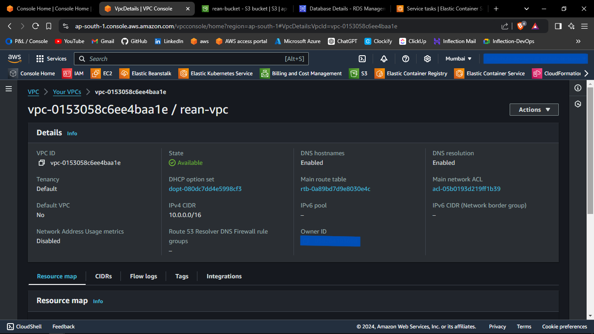
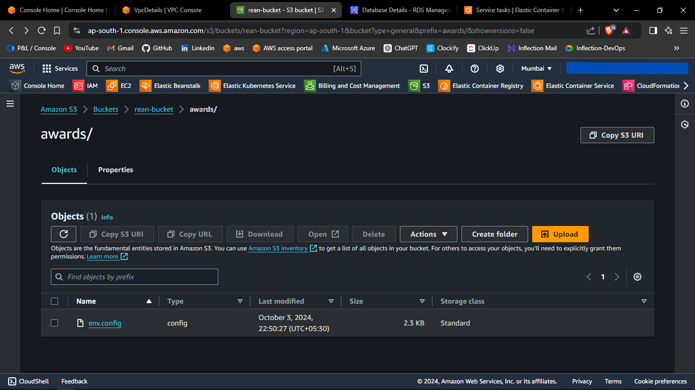
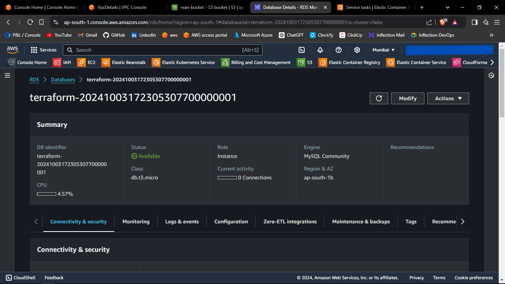
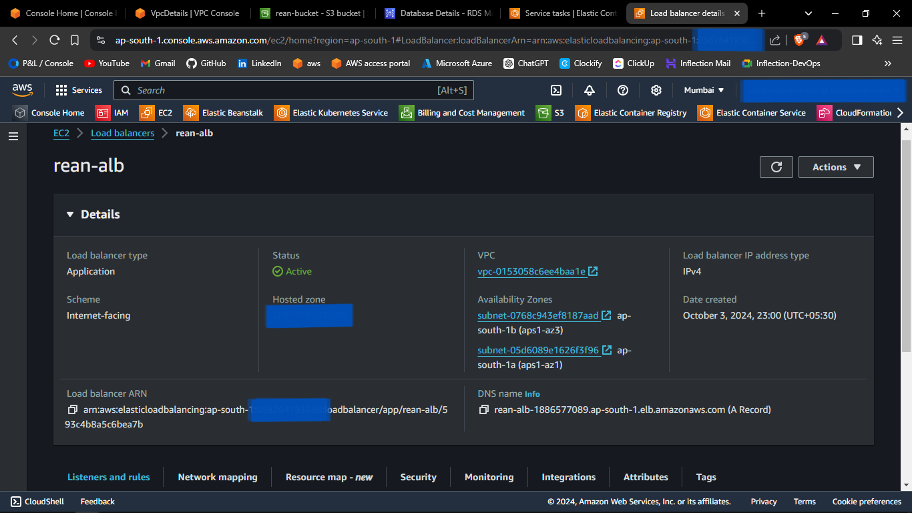
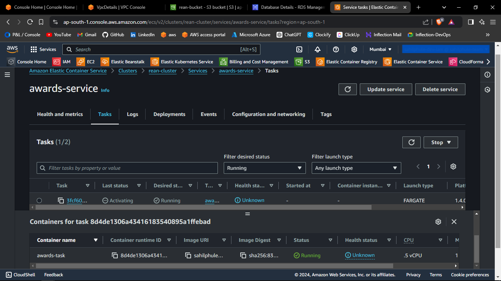

# Terraform ECS Deployment

### Prerequisites
1. AWS Account with an IAM User with administrative permissions.
2. Terraform installed.

---

## Using Terraform Modules to Provision AWS Infrastructure

1. Create the Terraform project.
2. Download the [modules](https://github.com/sahilphule/terraform/tree/master) folder and copy it inside the above-created terraform project.
3. Create a *provider.tf* file inside the created terraform project.
4. Inside the *provider.tf* file, define the following:
    - terraform
      - required_providers
    - provider
      - docker
      - aws
5. The reference code is attached below.

```js
terraform {
  required_providers {
    docker = {
      source  = "kreuzwerker/docker"
      version = "~> 2.20.0"
    }
    aws = {
      source  = "hashicorp/aws"
      version = "~> 5.64"
    }
  }
}

provider "docker" {}

provider "aws" {
  region = local.aws_region
  // shared_config_files = ["~/.aws/config"]
  shared_credentials_files = ["~/.aws/credentials"]
}
```

6. The definition of *provider.tf* file is complete.
7. Create the *main.tf* file.
8. Inside *main.tf* file, call the following modules:
    - vpc
    - s3
    - rds
    - ecr
    - load-balancer
    - ecs
9. Also define the following s3 resource for uploading local .env file:
    - aws_s3_object
10. The reference code is attached below.

```js
module "vpc" {
  source = "github.com/sahilphule/templates/terraform/modules/aws/vpc"

  vpc-properties = local.vpc-properties
}

module "s3" {
  source = "github.com/sahilphule/templates/terraform/modules/aws/s3"

  s3-properties = local.s3-properties
}

resource "aws_s3_object" "env-file" {
  bucket = local.s3-bucket-id
  key    = ""
  source = ""
  etag   = filemd5("")
}

module "rds" {
  source = "github.com/sahilphule/templates/terraform/modules/aws/rds"

  vpc-id              = local.vpc-id
  vpc-public-subnets  = local.vpc-public-subnets
  vpc-private-subnets = local.vpc-private-subnets
  database-properties = local.database-properties
  bastion-properties  = local.bastion-properties

  depends_on = [
    module.vpc
  ]
}

// module "ecr-repository" {
//  source        = "github.com/sahilphule/templates/terraform/modules/aws/ecr"
//  ecr-repository-name = local.ecr-repository-name
// }

module "load-balancer" {
  source = "github.com/sahilphule/templates/terraform/modules/aws/load-balancer"

  vpc-id                   = local.vpc-id
  vpc-public-subnets       = local.vpc-public-subnets
  vpc-private-subnets      = local.vpc-private-subnets
  load-balancer-properties = local.load-balancer-properties
}

module "ecs" {
  source = "github.com/sahilphule/templates/terraform/modules/aws/ecs"

  vpc-id              = local.vpc-id
  vpc-public-subnets  = local.vpc-public-subnets
  vpc-private-subnets = local.vpc-private-subnets

  ecs-properties           = local.ecs-properties
  ecs-container-definition = local.ecs-container-definition
  target-group-arn         = local.load-balancer-tg-arn
  load-balancer-sg-id      = local.load-balancer-sg-id

  depends_on = [
    module.s3,
    module.rds
  ]
}
```

10. *main.tf* file definition is completed.
11. Now we will create *locals.tf* file.
12. Define the following variables:
    - aws_region
    - vpc-properties
        - availability-zones
        - vpc-cidr-block
        - vpc-subnet-count
        - vpc-public-subnet-cidr-blocks
        - vpc-private-subnet-cidr-blocks
        - vpc-tag-value
        - vpc-public-subnet-tag-value
        - vpc-private-subnet-tag-value
        - vpc-igw-tag-value    
    - vpc-id
    - vpc-public-subnets
    - vpc-private-subnets
    - s3-properties
        - s3-bucket-name
        - s3-bucket-force-destroy
        - s3-bucket-versioning
    - s3-bucket-id
    - database-properties
        - db-identifier
        - db-allocated-storage
        - db-engine
        - db-engine-version
        - db-instance-class
        - db-skip-final-snapshot
        - db-publicly-accessible
        - db-username
        - db-password
        - db-sg-tag-value
        - db-tag-value
    - bastion-properties
        - bastion-host-instance-type
        - bastion-host-public-key
        - bastion-host-sg-tag-value
        - bastion-host-tag-value
    - ecr-repository-name
    - ecr-repository-url
    - repository-url
    - load-balancer-properties
        - load-balancer-name
        - load-balancer-type
        - load-balancer-tg-name
        - port
        - load-balancer-sg-tag-value
    - ecs-properties
        - ecs-cluster-name
        - ecs-task-execution-role-name
        - ecs-task-family
        - ecs-task-name
        - ecs-container-name
        - ecs-container-port
        - s3-config-bucket
        - s3-config-path
        - ecs-service-name
        - ecs-servics-sg-tag-value
    - ecs-container-definition
    - tg-arn
    - load-balancer-sg-id
19. The reference code is attached below.
```js
locals {

  aws_region = "ap-south-1"

  // vpc variables
  vpc-properties = {
    availability-zones = [
      "ap-south-1a",
      "ap-south-1b",
      "ap-south-1c"
    ]
    vpc-cidr-block = "10.0.0.0/16"
    vpc-subnet-count = {
      "public"  = 2,
      "private" = 2
    }
    vpc-public-subnet-cidr-blocks = [
      "10.0.1.0/24",
      "10.0.2.0/24",
      "10.0.3.0/24",
      "10.0.4.0/24"
    ]
    vpc-private-subnet-cidr-blocks = [
      "10.0.101.0/24",
      "10.0.102.0/24",
      "10.0.103.0/24",
      "10.0.104.0/24"
    ]

    vpc-tag-value                = "ecs-vpc"
    vpc-public-subnet-tag-value  = "ecs-public-vpc"
    vpc-private-subnet-tag-value = "ecs-private-vpc"
    vpc-igw-tag-value            = "ecs-igw"
  }

  vpc-id              = module.vpc.vpc-id
  vpc-private-subnets = module.vpc.vpc-private-subnets
  vpc-public-subnets  = module.vpc.vpc-public-subnets

  // s3 variables
  s3-properties = {
    s3-bucket-name          = ""
    s3-bucket-force-destroy = true
    s3-bucket-versioning    = "Disabled"
  }
  s3-bucket-id = module.s3.s3-bucket-id

  // rds variables
  database-properties = {
    db-identifier          = "ecs-db"
    db-allocated-storage   = 20
    db-engine              = "mysql"
    db-engine-version      = "8.0.35"
    db-instance-class      = "db.t3.micro"
    db-skip-final-snapshot = true
    db-publicly-accessible = false

    db-username = ""
    db-password = ""

    db-sg-tag-value = "ecs-db-sg"
  }

  bastion-properties = {
    bastion-host-instance-type = "t2.micro"
    bastion-host-public-key    = ""

    bastion-host-sg-tag-value = "ecs-bastion-host"
    bastion-host-tag-value    = "ecs-bastion-host"
  }

  // load balancer variables
  load-balancer-properties = {
    load-balancer-name    = "ecs-lb"
    load-balancer-type    = "application"
    load-balancer-tg-name = "ecs-lb-tg"
    port                  = "${local.ecs-properties.ecs-container-port}"

    load-balancer-sg-tag-value = "ecs-load-balancer-sg"
  }

  load-balancer-tg-arn = module.load-balancer.load-balancer-tg-arn
  load-balancer-sg-id  = module.load-balancer.load-balancer-sg-id

  // ecr variables
  // ecr-repository-name = "awards"
  // ecr-repository-url  = module.ecr-repository.repository-url

  // ecs variables
  ecs-properties = {
    ecs-cluster-name             = "ecs-cluster"
    ecs-task-execution-role-name = "ecs-task-execution-role"
    ecs-task-family              = "ecs-task-family"
    ecs-task-name                = "ecs-task"
    // ecs-ecr-repository-url           = "${local.ecr-repository-url}"
    ecs-dockerhub-repository-url = ""
    ecs-container-name           = ""
    ecs-container-port           = ""
    s3-config-bucket             = "${local.s3-properties.s3-bucket-name}"
    s3-config-path               = ""
    ecs-service-name             = "ecs-service"

    ecs-service-sg-tag-value = "ecs-service-sg"
  }

  ecs-container-definition = <<DEFINITION
    [
      {
        "name": "${local.ecs-properties.ecs-container-name}",
        "image": "${local.ecs-properties.ecs-dockerhub-repository-url}",
        "cpu": 512,
        "memory": 1024,
        "essential": true,
        "portMappings": [
          {
            "containerPort": ${local.ecs-properties.ecs-container-port},
            "hostPort": ${local.ecs-properties.ecs-container-port}
          }
        ],
        "environment": [
          {
            "name": "S3_CONFIG_BUCKET",
            "value": "${local.ecs-properties.s3-config-bucket}"
          },
          {
            "name": "S3_CONFIG_PATH",
            "value": "${local.ecs-properties.s3-config-path}"
          }
        ]
      }
    ]
    DEFINITION
}
```
14. The definition of *locals.tf* file is complete.
15. Now we will create *outputs.tf* file.
16. Define the following outputs:
    - DB_HOST
    - bastion-host-ip
17. The reference code is attached below.

```js
output "DB_HOST" {
  description = "db host address"
  value       = module.rds.DB_HOST
}

output "bastion-host-ip" {
  description = "bastion host ip address"
  value       = module.rds.bastion-host-ip
}
```

18. The definition of *outputs.tf* file is complete.

---

<br>
<br>
<br>
<br>
<br>
<br>
<br>

## Provisioning the Infrastructure
Now we will provision the infrastructure by applying the above-created configuration files.

> Ensure AWS CLI is configured with appropriate AWS user credentials and enough permissions.

### Steps:
1. Open the PowerShell.
2. Change the directory to the above-created Terraform Project.
3. Run the `terraform init` command to initialize the *terraform*.  
4. Run the `terraform fmt --recursive` command to format the syntax of the files.
5. Run the `terraform validate` command to validate the configuration files.
6. Run the `terraform plan` command to plan the resources to be created.
7. Run the `terraform apply` command and if prompted, type `yes` to provision the infrastructure.
8. Run the `terraform output` command to get the values of defined variables in *outputs.tf* file.
9. Head to the AWS console, and verify the created resources.
10. Then,
    - Head towards EC2 dashboard.
    - Select *Load Balancers*, and select the created load balancer.
    - Copy the DNS address.
    - Paste the address in the browser to access the application.

---

## Screenshots of Provisioned Infrastructure
---

### VPC Image


---

### S3 Image


---

### RDS Image


---

<br>
<br>
<br>
<br>

### ALB Image


---

### ECS Image


---

<br>
<br>
<br>
<br>

## Connect to the RDS database through Bastion Host
1. Open MySQL Workbench.
2. Click Add Connection.
3. Select connection method as **Standard TCP/IP over SSH**.
4. In SSH Hostname, enter *bastion-host-ip:22* where bastion-host-ip is received from `terraform output`.
5. In SSH Username, enter *ec2-user*.
6. In SSH Key File, select *bastion-key.pem* file passed in above *locals.tf* file from your local computer.
7. In MySQL Hostname, enter *DB_HOST* where DB_HOST is received from `terraform output`.
8. In the Password section, select *Store in Vault*, and enter the password passed in above-created *locals.tf* file.
9. Click *OK* and open the connection.
10. Now you can run mysql commands to access databases, and verify the successful connection of *ecs-container*.

---

## Screenshots of MySQL Workbench

---

### Connection Page


---

<br>
<br>
<br>
<br>
<br>
<br>
<br>

### Commands Page


---

## Destroy the provisioned infrastructure

1. To destroy infrastructure, change directory to the above created Terraform Project.
2. Run `terraform destroy` & if prompted, type `yes`.
3. Infrastructure will be destroyed.

---