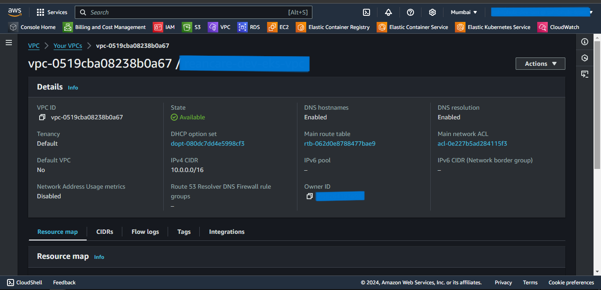
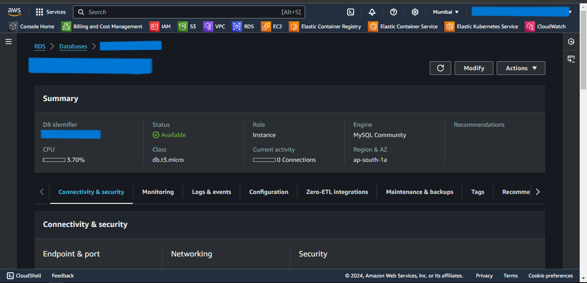
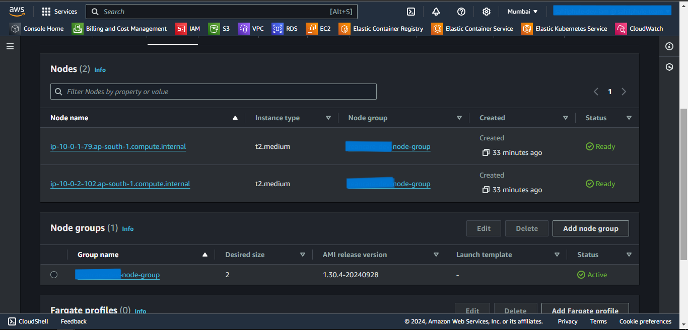
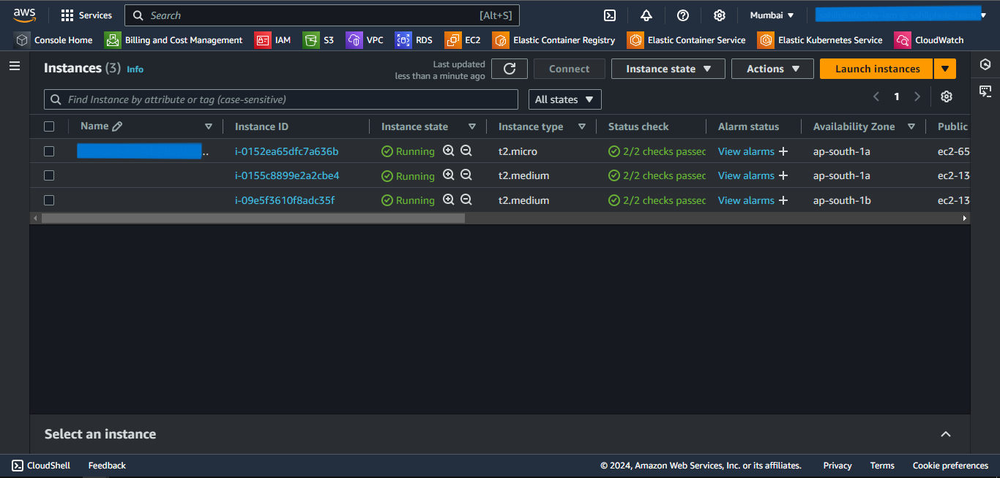
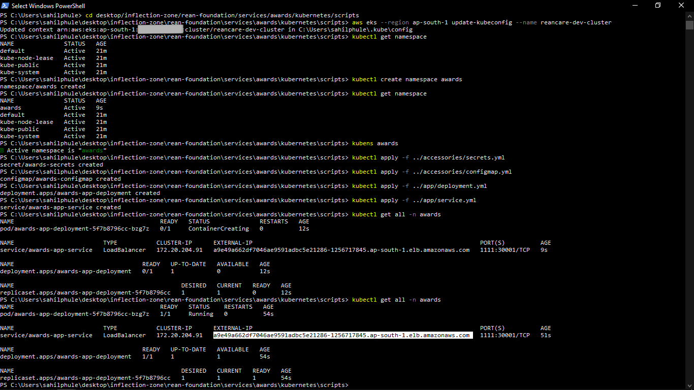

# Terraform EKS Deployment

### Prerequisites
1. AWS Account with an IAM User with administrative permissions.
2. Terraform installed.
3. Kubectl & Kubens installed.

---

## Using Terraform Modules to Provision AWS Infrastructure

1. Create the Terraform project.
2. Download the [modules](https://github.com/sahilphule/terraform/tree/master) folder and copy it inside the above-created terraform project.
3. Create a *provider.tf* file inside the created terraform project.
4. Inside the *provider.tf* file, define the following:
    - terraform
      - required_providers
    - provider
      - aws
5. The reference code is attached below.

```js
terraform {
  required_providers {
    aws = {
      source  = "hashicorp/aws"
      version = "~> 5.64"
    }
  }
}

provider "aws" {
  region = local.aws_region
  // shared_config_files = ["~/.aws/config"]
  shared_credentials_files = ["~/.aws/credentials"]
}
```

6. The definition of *provider.tf* file is complete.
7. Create the *main.tf* file.
8. Inside *main.tf* file, call the following modules:
    - vpc
    - rds
    - eks
9. The reference code is attached below.

```js
module "vpc" {
  source = "github.com/sahilphule/templates/terraform/modules/aws/vpc"

  vpc-properties = local.vpc-properties
}

module "rds" {
  source = "github.com/sahilphule/templates/terraform/modules/aws/rds"

  vpc-id              = local.vpc-id
  vpc-public-subnets  = local.vpc-public-subnets
  vpc-private-subnets = local.vpc-private-subnets
  database-properties = local.database-properties
  bastion-properties  = local.bastion-properties

  depends_on = [
    module.vpc
  ]
}

module "eks" {
  source = "github.com/sahilphule/templates/terraform/modules/aws/eks"

  vpc-public-subnets  = local.vpc-public-subnets
  vpc-private-subnets = local.vpc-private-subnets

  eks-properties = local.eks-properties

  depends_on = [
    module.rds
  ]
}
```

10. *main.tf* file definition is completed.
11. Now we will create *locals.tf* file.
12. Define the following variables:
    - aws_region  
    - vpc-properties
        - availability-zones
        - vpc-cidr-block
        - vpc-subnet-count
        - vpc-public-subnet-cidr-blocks
        - vpc-private-subnet-cidr-blocks
        - vpc-tag-value
        - vpc-public-subnet-tag-value
        - vpc-private-subnet-tag-value
        - vpc-igw-tag-value
    - vpc-id
    - vpc-public-subnets
    - vpc-private-subnets
    - database-properties
        - identifier
        - allocated-storage
        - engine
        - engine-version
        - instance-class
        - skip-final-snapshot
        - publicly-accessible
        - db-username
        - db-password
        - db-sg-tag-value
        - db-tag-value
    - bastion-properties
        - count
        - instance-type
        - bastion-host-public-key
        - bastion-host-sg-tag-value
        - bastion-host-tag-value
    - eks-properties
        - eks-cluster-role-name
        - eks-cluster-name
        - eks-node-role-name
        - eks-node-group-name
        - eks-instance-types
        - eks-service-port
13. The reference code is attached below.

```js
locals {

  aws_region = "ap-south-1"

  // vpc variables
  vpc-properties = {
    availability-zones = [
      "ap-south-1a",
      "ap-south-1b",
      "ap-south-1c"
    ]
    vpc-cidr-block = "10.0.0.0/16"
    vpc-subnet-count = {
      "public"  = 2,
      "private" = 2
    }
    vpc-public-subnet-cidr-blocks = [
      "10.0.1.0/24",
      "10.0.2.0/24",
      "10.0.3.0/24",
      "10.0.4.0/24"
    ]
    vpc-private-subnet-cidr-blocks = [
      "10.0.101.0/24",
      "10.0.102.0/24",
      "10.0.103.0/24",
      "10.0.104.0/24"
    ]

    vpc-tag-value                = "eks-vpc"
    vpc-public-subnet-tag-value  = "eks-public-vpc-subnet"
    vpc-private-subnet-tag-value = "eks-private-vpc-subnet"
    vpc-igw-tag-value            = "eks-igw"
  }

  vpc-id              = module.vpc.vpc-id
  vpc-public-subnets  = module.vpc.vpc-public-subnets
  vpc-private-subnets = module.vpc.vpc-private-subnets

  // rds variables
  database-properties = {
    db-identifier          = "eks-db"
    db-allocated-storage   = 20
    db-engine              = "mysql"
    db-engine-version      = "8.0.35"
    db-instance-class      = "db.t3.micro"
    db-skip-final-snapshot = true
    db-publicly-accessible = false

    db-username = ""
    db-password = ""

    db-sg-tag-value = "eks-db-sg"
  }

  bastion-properties = {
    bastion-host-instance-type = "t2.micro"
    bastion-host-public-key    = ""

    bastion-host-sg-tag-value = "eks-bastion-host"
    bastion-host-tag-value    = "eks-bastion-host"
  }

  // eks variables
  eks-properties = {
    eks-cluster-role-name = "eks-cluster-role"
    eks-cluster-name      = "eks-cluster"
    eks-node-role-name    = "eks-node-group-role"
    eks-node-group-name   = "eks-node-group"
    eks-instance-types = [
      "t2.medium"
    ]
  }
}
```

14. The definition of *locals.tf* file is complete.
15. Now we will create *outputs.tf* file.
16. Define the following outputs:
    - DB_HOST
    - bastion-host-ip
17. The reference code is attached below.

```js
output "DB_HOST" {
  description = "db host address"
  value       = module.rds.DB_HOST
}

output "bastion-host-ip" {
  description = "bastion host ip address"
  value       = module.rds.bastion-host-ip
}
```

18. The definition of *outputs.tf* file is complete.

---
---

## Provisioning the Infrastructure
Now we will provision the infrastructure by applying the above-created configuration files.

> Ensure AWS CLI is configured with appropriate AWS user credentials and enough permissions.

### Steps:
1. Open the PowerShell.
2. Change the directory to the above-created Terraform Project.
3. Run the `terraform init` command to initialize the *terraform*.  
4. Run the `terraform fmt --recursive` command to format the syntax of the files.
5. Run the `terraform validate` command to validate the configuration files.
6. Run the `terraform plan` command to plan the resources to be created.
7. Run the `terraform apply` command and if prompted, type `yes` to provision the infrastructure.
8. Run the `terraform output` command to get the values of defined variables in *outputs.tf* file.
9. Head to the AWS Console, and verify the created resources.

---

<br>
<br>
<br>
<br>

## Screenshots of Provisioned Infrastructure

---

### VPC Image


---

### RDS Image


---

<br>
<br>
<br>
<br>
<br>
<br>
<br>

### EKS Cluster Image


---

### EKS Node Group Image


---

<br>
<br>
<br>
<br>
<br>
<br>
<br>
<br>
<br>

### EKS Nodes Image


---

## Connect to EKS Cluster from Powershell

1. Open a new Powershell window.
2. Run the following command to configure local kubectl with eks cluster  
    `aws eks --region "region-name" update-kubeconfig --name "cluster-name"`  
    Substitute *region-name* and *cluster-name* with the values defined in the above-created locals.tf file.
3. Now apply the Kubernetes manifest files of the application.
4. To list them all, run `kubectl get all`.

### Powershell Image


5. If a Load Balancer type Service is present then try accessing the External IP of that service in the browser.

### Browser Service Access


---

## Connect to the RDS database through Bastion Host
1. Open MySQL Workbench.
2. Click Add Connection.
3. Select connection method as **Standard TCP/IP over SSH**.
4. In SSH Hostname, enter *bastion-host-ip:22* where bastion-host-ip is received from `terraform output`.
5. In SSH Username, enter *ec2-user*.
6. In SSH Key File, select *bastion-key.pem* file passed in above *locals.tf* file from your local computer.
7. In MySQL Hostname, enter *DB_HOST* where DB_HOST is received from `terraform output`.
8. In the Password section, select *Store in Vault*, and enter the password passed in above-created *locals.tf* file.
9. Click *OK* and open the connection.
10. Now you can run mysql commands to access databases, and verify the successful connection of *eks-nodes*.

<br>
<br>
<br>
<br>
<br>
<br>
<br>

### MySQL Workbench Connection Page


---

### MySQL Workbench Commands Page


---

<br>
<br>
<br>
<br>
<br>

## Destroy the provisioned infrastructure

1. Firstly, delete all the Kubernetes Deployments.
2. To destroy infrastructure, change directory to the above created Terraform Project.
3. Run `terraform destroy` & if prompted, type `yes`.
4. Infrastructure will be destroyed.

---