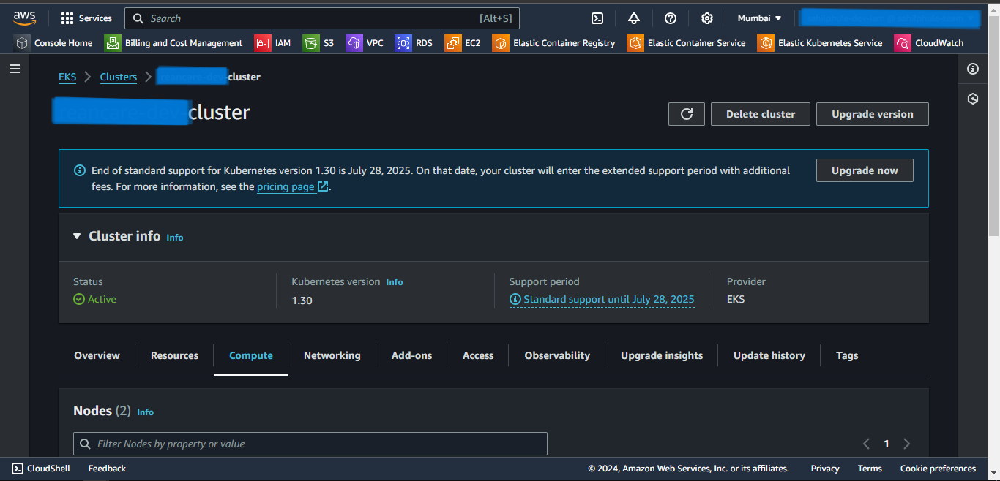
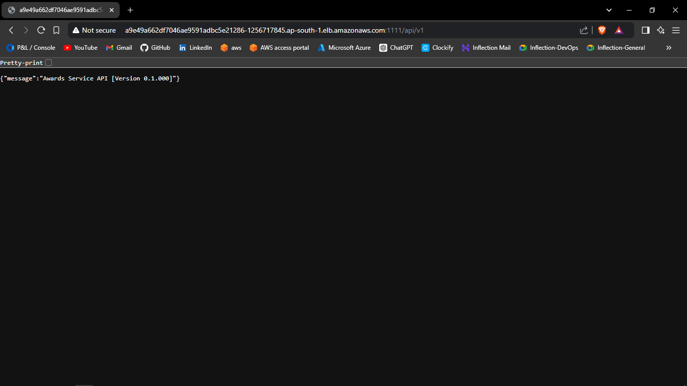
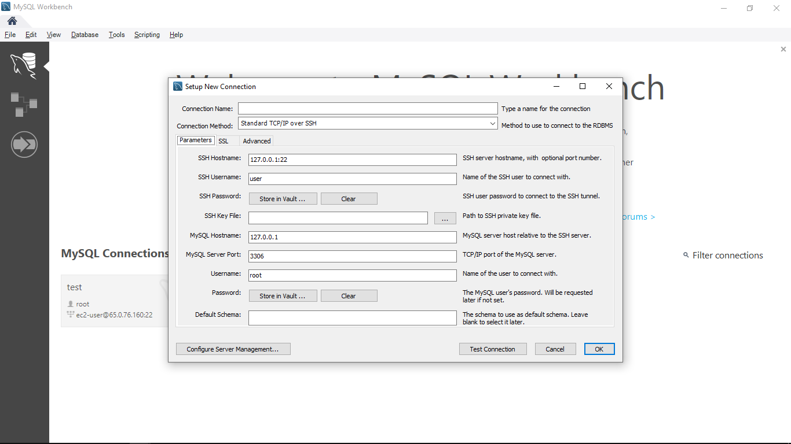

# EKS Provisioning using Terraform

### Prerequisites
1. AWS Account with an IAM User with administrative permissions.
2. Terraform installed.
3. Kubectl installed.

---

## Steps

1. Create the **eks-terraform** directory.
2. Folders structure for the above-created directory:
```
eks-terraform
│───.terraform.lock.hcl
│───locals.tf
│───main.tf
│───outputs.tf
│───providers.tf
│───terraform.tfstate
│───terraform.tfstate.backup
└───.terraform
```

> We need to only create *providers.tf*, *main.tf*, *outputs.tf*, & *locals.tf* file. Other files are generated while initiating terraform.

3. Create a *providers.tf* file inside the above-created directory.
4. Inside the *provider.tf* file, define the following:
    - terraform
      - required_providers
    - provider
      - aws
5. Click [code](https://github.com/inflection-sahil/devops/blob/master/terraform/aws/eks/providers.tf) for reference.
6. The definition of *providers.tf* file is complete.
7. Now, create the *main.tf* file.
8. Inside *main.tf* file, we will use the following predefined modules:
    - vpc
    - rds
    - eks
9. Click [code](https://github.com/inflection-sahil/devops/blob/master/terraform/aws/eks/main.tf) for reference.
10. The definition of *main.tf* file is complete.
11. Now we will create *outputs.tf* file.
12. Inside it, define the following outputs.
    - DB_HOST
    - bastion-host-ip
13. Click [code](https://github.com/inflection-sahil/devops/blob/master/terraform/aws/eks/outputs.tf) for reference.
14. The definition of *outputs.tf* file is complete.
15. Now we will create *locals.tf* file.
16. Inside it, define the followiing variables:
    - vpc-properties
    - database-properties
    - bastion-properties
    - eks-properties
17. Click [code](https://github.com/inflection-sahil/devops/blob/master/terraform/aws/eks/sample-locals.txt) for reference.
18. The definition of *locals.tf* file is complete.

> Make sure you give the appropriate values to the varibles defined in *locals.tf* file.

---

## Provisioning the Infrastructure
Now we will provision the AWS infrastructure by applying the above-created configuration files.

> Ensure AWS CLI is configured with appropriate AWS user credentials and enough permissions.

### Steps:
1. Open the PowerShell.
2. Change the directory to the above-created **eks-terraform** directory using `cd` command.
3. Run the `terraform init` command to initialize the *terraform*.  
4. Run the `terraform fmt --recursive` command to format the syntax of the files.
5. Run the `terraform validate` command to validate the configuration files.
6. Run the `terraform plan` command to plan the resources to be created.
7. Run the `terraform apply` command and if prompted, type `yes` to provision the infrastructure.
8. Run the `terraform output` command to get the values of defined variables in *outputs.tf* file.
9. Head to the AWS Console, and verify the created resources.

---

<div style="page-break-after: always;"></div>

## Screenshots of Provisioned Infrastructure

---

### VPC Image


---

### RDS Image


---

<div style="page-break-after: always;"></div>

### EKS Cluster Image


---

### EKS Node Group Image


---

<div style="page-break-after: always;"></div>

### EKS Nodes Image


---

## Connect to EKS Cluster from Powershell

1. Open a new Powershell window.
2. Run the following command to configure local kubectl with eks cluster  
    `aws eks --region "region-name" update-kubeconfig --name "cluster-name"`  
    Substitute *region-name* and *cluster-name* with the values defined in the above-created locals.tf file.
3. Now apply the Kubernetes manifest files of the application.
4. To list them all, run `kubectl get all`.

<div style="page-break-after: always;"></div>

### Powershell Image


5. If a Load Balancer type Service is present then try accessing the External IP of that service in the browser.

### Browser Service Access


---

<div style="page-break-after: always;"></div>

## Connection to the RDS database through Bastion Host using MySQL Workbench
1. Open MySQL Workbench.
2. Click Add Connection.
3. Select connection method as **Standard TCP/IP over SSH**.
4. In SSH Hostname, enter *bastion-host-ip:22* where bastion-host-ip is received from `terraform output`.
5. In SSH Username, enter *ec2-user*.
6. In SSH Key File, select *bastion-key.pem* file passed in above *locals.tf* file from your local computer.
7. In MySQL Hostname, enter *DB_HOST* where DB_HOST is received from `terraform output`.
8. In the Password section, select *Store in Vault*, and enter the password passed in above-created *locals.tf* file.
9. Click *OK* and open the connection.
10. Now you can run mysql commands to access databases, and verify the successful connection of *eks-nodes*.

---

## Screenshots of MySQL Workbench

---

### Connection Page


---

<div style="page-break-after: always;"></div>

### Commands Page


---

## Destroy the provisioned infrastructure

1. Firstly, delete all the Kubernetes Deployments.
2. To destroy infrastructure, change directory to the above-created **eks-terraform** directory using `cd` command.
3. Run `terraform destroy` & if prompted, type `yes`.
4. Infrastructure will be destroyed.

---