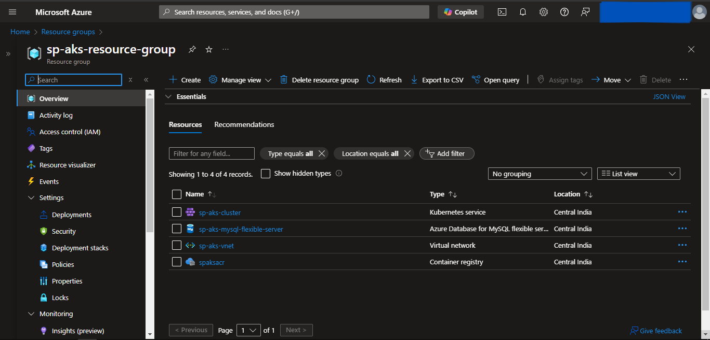
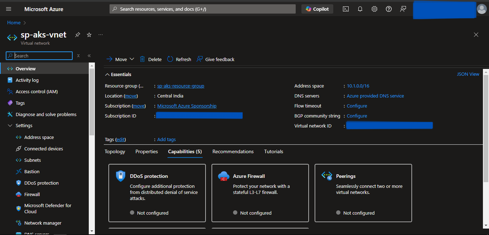
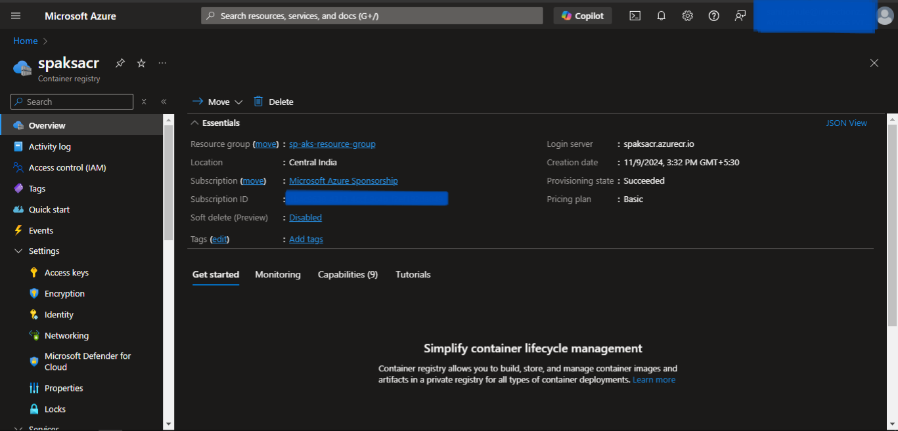
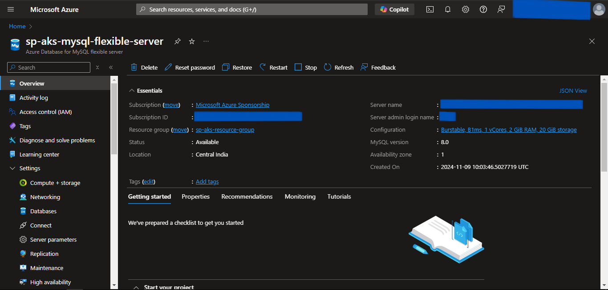

# AKS Provisioning using Terraform

### Prerequisites
1. Azure Account with Subscription.
2. Terraform installed.
3. Kubectl installed.

---

## Steps
1. Create the **aks-terraform** directory.
2. Folders structure for the above-created directory is as follows:
```
aks-terraform
│───.terraform.lock.hcl
│───locals.tf
│───main.tf
│───outputs.tf
│───providers.tf
│───terraform.tfstate
│───terraform.tfstate.backup
└───.terraform
```

> We need to only create *providers.tf*, *main.tf*, *outputs.tf*, & *locals.tf* file. Other files are generated while initiating terraform.

3. Create a *providers.tf* file inside the above-created directory.
4. Inside it, define the following:
    - terraform
      - required_providers
    - provider
      - azurerm
5. Click [code](https://github.com/inflection-sahil/devops/blob/master/terraform/azure/aks/providers.tf) for reference.
6. The definition of *providers.tf* file is complete.
7. Now, create the *main.tf* file.
8. Inside *main.tf* file, we will use the following predefined modules:
    - resource-group
    - virtual-network
    - acr
    - mysql-flexible
    - aks
9. Click [code](https://github.com/inflection-sahil/devops/blob/master/terraform/azure/aks/main.tf) for reference.
10. The definition of *main.tf* file is complete.
11. Now we will create *outputs.tf* file.
12. Inside it, define the following outputs.
    - acr-login-server
    - acr-admin-username
    - acr-admin-password
    - DB_HOST
13. Click [code](https://github.com/inflection-sahil/devops/blob/master/terraform/azure/aks/outputs.tf) for reference.
14. The definition of *outputs.tf* file is complete.
15. Now we will create *locals.tf* file.
16. Inside it, define the followiing variables:
    - resource-group-properties
    - virtual-network-properties
    - acr-properties
    - mysql-flexible-properties
    - aks-properties
17. Click [code](https://github.com/inflection-sahil/devops/blob/master/terraform/azure/aks/sample-locals.txt) for reference.
18. The definition of *locals.tf* file is complete.

> Make sure you give the appropriate values to the varibles defined in *locals.tf* file.

---

## Provisioning the Infrastructure
Now we will provision the Azure infrastructure by applying the above-created configuration files.

> Ensure Azure CLI is configured with appropriate Azure Account credentials with enough permissions.

### Steps:
1. Open the PowerShell.
2. Change the directory to the above-created **eks-terraform** directory using **`cd`** command.
3. Run the **`terraform init`** command to initialize the *terraform*.
4. Run the **`terraform fmt -recursive`** command to format the syntax of the files.
5. Run the **`terraform validate`** command to validate the configuration files.
6. Run the **`terraform plan`** command to plan the resources to be created.
7. Run the **`terraform apply`** command and if prompted, type **`yes`** to provision the infrastructure.
8. Run the **`terraform output`** command to get the values of defined variables in *outputs.tf* file.
9. Head to the Azure Console, and verify the created resources.

---

<div style="page-break-after: always;"></div>

## Screenshots of Provisioned Infrastructure

---

### Resource Group Image


---

### Virtual Network Image


---

<div style="page-break-after: always;"></div>

### ACR Image


---

### MySQL Flexible Server Image


---

<div style="page-break-after: always;"></div>

### AKS Image


---

## Build and push Docker Image to ACR

1. Open a new Powershell window.
2. Run the following commands to login into ACR:
    - **`az login`**
    - **`az acr login --name "acr-name"`**
3. Then tag & push the docker image using the following commands:
    - **`docker tag "image-name:tag" "acr-name".azurecr.io/"image-name:tag"`**
    - **`docker push "acr-name".azurecr.io/"image-name:tag"`**  
    Substitute *acr-name* with the value defined in the above-created locals.tf file. Also, substitute *image-name:tag* with it's respective name.

---

## Connect to the AKS Cluster from Powershell

1. Open a new Powershell window.
2. Run the following commands to configure local kubectl with aks cluster:
    - **`az login`**
    - **`az account set --subscription "subscription-id"`**
    - **`az aks get-credentials --resource-group "resource-group-name" --name "cluster-name" --overwrite-existing`**  
Substitute *subscription-id* which can be found by running **`az account list`** in the *id* field. Also, substitute *resource-group-name* and *cluster-name* with the values defined in the above-created locals.tf file.
3. Now apply the Kubernetes manifest files of the application using the following command:
    - **`kubectl apply -f "file-path"`**  
    Substitute *file-path* with the kubernetes manifest file path.
4. To list them all, run **`kubectl get all`**.
5. If a Load Balancer type Service is present then try accessing the External IP of that service in the browser.

---

## Destroy the provisioned infrastructure

1. Firstly, delete all the Kubernetes Deployments using:
    - **`kubectl delete -f "file-path"`**  
    Substitute *file-path* with the kubernetes manifest file path.
2. To destroy infrastructure, change directory to the above-created **aks-terraform** directory using **`cd`** command.
3. Run **`terraform destroy`** & if prompted, type **`yes`**.
4. Infrastructure will be destroyed.

---