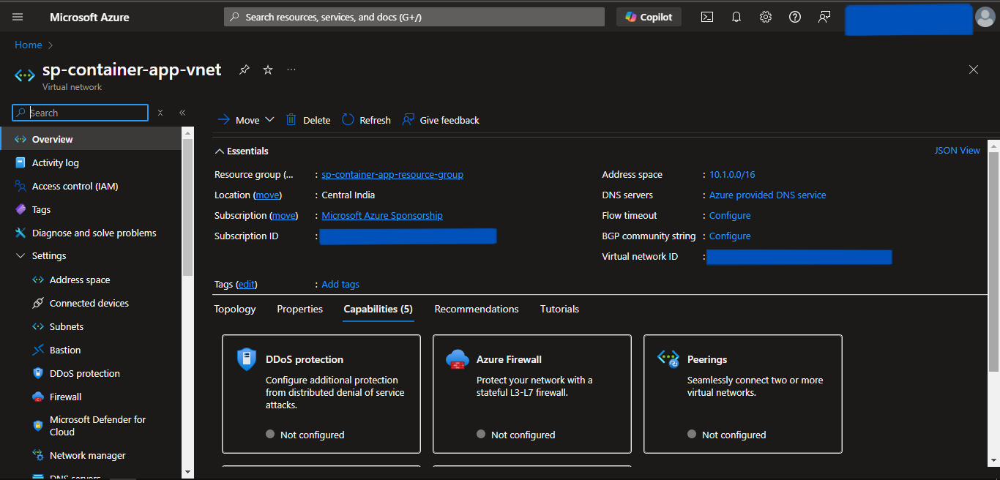

# Container Apps Provisionig using Terraform
- We will provision the Container App using Terraform as an Infrasturcture as Code.
- We will deploy it in custom Virtual Network for isolation.
- We will connect the Container App to ACR for Docker Image.
- We will also create Storage Account Container to store the *.env* file.
- Also will deploy MySQL Flexible to store the relational data and connect it to Container App.

---

### Prerequisites
1. Azure Account with Subscription.
2. Terraform installed.

---

## Steps
1. Create the **container-apps-terraform** directory.
2. Folders structure for the above-created directory is as follows:
```
container-apps-terraform
│───.terraform.lock.hcl
│───locals.tf
│───main.tf
│───outputs.tf
│───providers.tf
│───terraform.tfstate
│───terraform.tfstate.backup
└───.terraform
```

> We need to only create *providers.tf*, *main.tf*, *outputs.tf*, & *locals.tf* file. Other files are generated while initiating terraform.

3. Create a *providers.tf* file inside the above-created directory.
4. Inside it, define the following:
    - terraform
      - required_providers
    - provider
      - azurerm
5. Click [code](https://github.com/inflection-sahil/devops/blob/master/terraform/azure/container-apps/providers.tf) for reference.
6. The definition of *providers.tf* file is complete.
7. Now, create the *main.tf* file.
8. Inside *main.tf* file, we will use the following predefined modules:
    - resource-group
    - virtual-network
    - acr
    - mysql-flexible
    - storage
    - container-apps
9. Click [code](https://github.com/inflection-sahil/devops/blob/master/terraform/azure/container-apps/main.tf) for reference.
10. The definition of *main.tf* file is complete.
11. Now we will create *outputs.tf* file.
12. Inside it, define the following outputs.
    - acr-login-server
    - acr-admin-username
    - acr-admin-password
    - DB_HOST
    - container-apps-url
13. Click [code](https://github.com/inflection-sahil/devops/blob/master/terraform/azure/container-apps/outputs.tf) for reference.
14. The definition of *outputs.tf* file is complete.
15. Now we will create *locals.tf* file.
16. Inside it, define the following variables:
    - resource-group-properties
    - virtual-network-properties
    - acr-properties
    - mysql-flexible-properties
    - storage-properties
    - container-apps-properties
17. Click [code](https://github.com/inflection-sahil/devops/blob/master/terraform/azure/container-apps/sample-locals.txt) for reference.
18. The definition of *locals.tf* file is complete.

> Make sure you give the appropriate values to the varibles defined in *locals.tf* file. Also update the *sb-object-source-path* variable under *storage-properties* with local *.env* file relative path.

---

## Provisioning the Infrastructure
Now we will provision the Azure infrastructure by applying the above-created configuration files.

> Ensure Azure CLI is configured with appropriate Azure Account credentials with enough permissions.

> Also first provision the ACR, push the Docker Image and then provision the Container App. To do that, comment out the **container-app** module and follow the further steps.

---

### Steps:
1. Open the PowerShell.
2. Change the directory to the above-created **container-apps-terraform** directory using **`cd`** command.
3. Run the **`terraform fmt -recursive`** command to format the syntax of the files.
4. Run the **`terraform init`** command to initialize the *terraform*.
5. Run the **`terraform validate`** command to validate the configuration files.
6. Run the **`terraform plan`** command to plan the resources to be created.
7. Run the **`terraform apply`** command and if prompted, type **`yes`** to provision the infrastructure.
8. Once completed, head to the Azure Console, and verify the created resources.

---

## Screenshots of Provisioned Infrastructure

---

### Resource Group Image


---

### Virtual Network Image


---

<div style="page-break-after: always;"></div>

### ACR Image


---

### MySQL Flexible Server Image


---

<div style="page-break-after: always;"></div>

### Storage Account Container Image


---

### Storage Account Container Env File


---

<div style="page-break-after: always;"></div>

## Now push the Docker Image to ACR

1. Open a new Powershell window.
2. Run the following commands to login into ACR:
    - `az login`
    - `az acr login --name "acr-name"`
3. Then tag & push the docker image using the following commands:
    - `docker tag "image-name:tag" "acr-name".azurecr.io/"image-name:tag"`
    - `docker push "acr-name".azurecr.io/"image-name:tag"`  
    Substitute *acr-name* with the value defined in the above-created locals.tf file. Also, substitute *image-name:tag* with it's respective name.

---

## Provisioning the Container App

> Uncomment the **container-app** module that we commented earlier and follow the further steps.

---

### Steps:
1. Change window to the PowerShell.
2. Run the **`terraform fmt -recursive`** command to format the syntax of the files.
3. Run the **`terraform init`** command to initialize the *terraform*.
4. Run the **`terraform validate`** command to validate the configuration files.
5. Run the **`terraform plan`** command to plan the resources to be created.
6. Run the **`terraform apply`** command and if prompted, type **`yes`** to provision the infrastructure.
7. Once completed, head to the Azure Console, and verify the created resources.
8. Run the **`terraform output`** command to get the values of defined variables in *outputs.tf* file.
9. Then,
    - Copy the *container-app-url*.
    - Paste the address in the browser to access the application.

---

<div style="page-break-after: always;"></div>

### Container Apps Image


---

## Destroy the provisioned infrastructure

1. To destroy infrastructure, change directory to the above-created **container-apps-terraform** directory using **`cd`** command.
2. Run **`terraform destroy`** & if prompted, type **`yes`**.
3. Infrastructure will be destroyed.

---