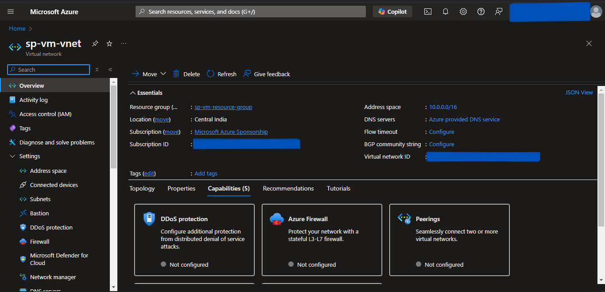

# Azure Virtual Machine Provisioning using Terraform
- We will provision the Azure Virtual Machine using Terraform as an Infrastructure as Code.
- We will deploy it in a custom Virtual Network for isolation.
- We will SSH into the Virtual Machine, and install the docker.
- Then, we will deploy the Nginx Container and try accessing it on the Web Browser.

---
## Prerequisites
---

1. Azure Account with Subscription.
2. Terraform installed.

---
## Write Terraform Configuration files
---

First, we will write Terraform configuration files for Azure resources using predefined modules available on the internet.

## Steps
1. Create the **virtual-machine-terraform** directory.
2. The folder structure for the above-created directory is as follows:
```
virtual-machine-terraform
│───.terraform.lock.hcl
│───locals.tf
│───main.tf
│───outputs.tf
│───providers.tf
│───terraform.tfstate
│───terraform.tfstate.backup
└───.terraform
```

> We need to only create *providers.tf*, *main.tf*, *outputs.tf*, & *locals.tf* files. Other files are generated while initiating terraform.

3. Create a *providers.tf* file inside the above-created directory.
4. Inside it, define the following:
    - terraform
      - required_providers
    - provider
      - azurerm
5. Click [code](https://github.com/inflection-zone/iac-recipes/blob/inflection-sahil/terraform/azure/virtual-machine/providers.tf) for reference.
6. The definition of *providers.tf* file is complete.
7. Now, create the *main.tf* file.
8. Inside *main.tf* file, we will use the following predefined modules:
    - module.resource-group
    - module.virtual-network
    - module.virtual-machine
9. Click [code](https://github.com/inflection-zone/iac-recipes/blob/inflection-sahil/terraform/azure/virtual-machine/main.tf) for reference.
10. The definition of *main.tf* file is complete.
11. Now we will create *outputs.tf* file.
12. Inside it, define the following outputs.
    - output.vm-public-ip
13. Click [code](https://github.com/inflection-zone/iac-recipes/blob/inflection-sahil/terraform/azure/virtual-machine/outputs.tf) for reference.
14. The definition of *outputs.tf* file is complete.
15. Now we will create *locals.tf* file.
16. Inside it, define the following variables:
    - local.resource-group-properties
    - local.virtual-network-properties
    - local.virtual-machine-properties
17. Click [code](https://github.com/inflection-zone/iac-recipes/blob/inflection-sahil/terraform/azure/virtual-machine/sample-locals.txt) for reference.
18. The definition of *locals.tf* file is complete.

> Ensure you give the appropriate values to the variables defined in *locals.tf* file.

---
## Provisioning the Infrastructure
---

Now we will provision the Azure infrastructure by applying the above-created configuration files.
> Ensure Azure CLI is configured with appropriate Azure Account credentials and enough permissions.

## Steps:
1. Open the PowerShell Window.
2. Change the directory to the above-created **virtual-machine-terraform** directory using the **`cd`** command.
3. Run the **`terraform fmt -recursive`** command to format the syntax of the files.
4. Run the **`terraform init`** command to initialize the *terraform*.
5. Run the **`terraform validate`** command to validate the configuration files.
6. Run the **`terraform plan`** command to plan the resources to be created.
7. Run the **`terraform apply`** command and if prompted, type **`yes`** to provision the infrastructure.
8. Run the **`terraform output`** command to get the values of defined variables in *outputs.tf* file.
9. Head to the Azure Console, and verify the created resources.

---
<div style="page-break-after: always;"></div>

---
## Screenshots of Provisioned Infrastructure
---

### Resource Group Image


---

### Virtual Network Image


---
<div style="page-break-after: always;"></div>

### Public IP Image


---

### Network Interface Card Image


---
<div style="page-break-after: always;"></div>

### Network Security Group Image


---

### Virtual Machine Image


---
<div style="page-break-after: always;"></div>

---
## SSH Into Azure VM
---

Now we will SSH into the Azure VM and configure it for Nginx container deployment.

## Steps
1. Open the Powershell Window.
2. Run the following command to SSH into Azure VM and substitute the <*admin-username*> with the value provided in *locals.tf* file under <*virtual-machine-properties*> section and <*vm-public-ip*> with the Azure VM Public IP received from **`terraform output`** command:
```sh
    ssh -o StrictHostKeyChecking=no <admin-username>@<vm-public-ip>
```
3. It will promt for password, enter the <*admin-password*> provided in the *locals.tf* file under <*virtual-machine-properties*> section.
4. Once you enter the server, run the following commands to install the necessary dependencies for deployment and run the nginx container:
```sh
    sudo apt update
    sudo apt install -y docker.io
    sudo docker run -d -p 80:80 nginx
```
9. Try accessing it on the browser using <*vm-public-ip*> received from **`terraform output`** command.

### Nginx Image


---
<div style="page-break-after: always;"></div>

---
## Destroy the provisioned infrastructure
---

Lastly, we will destroy the above-created resources.

## Steps
1. To destroy infrastructure, open the Powershell Window and change the directory to the above-created **virtual-machine-terraform** directory using the **`cd`** command.
2. Run **`terraform destroy`** & if prompted, type **`yes`**.
3. Infrastructure will be destroyed.

---