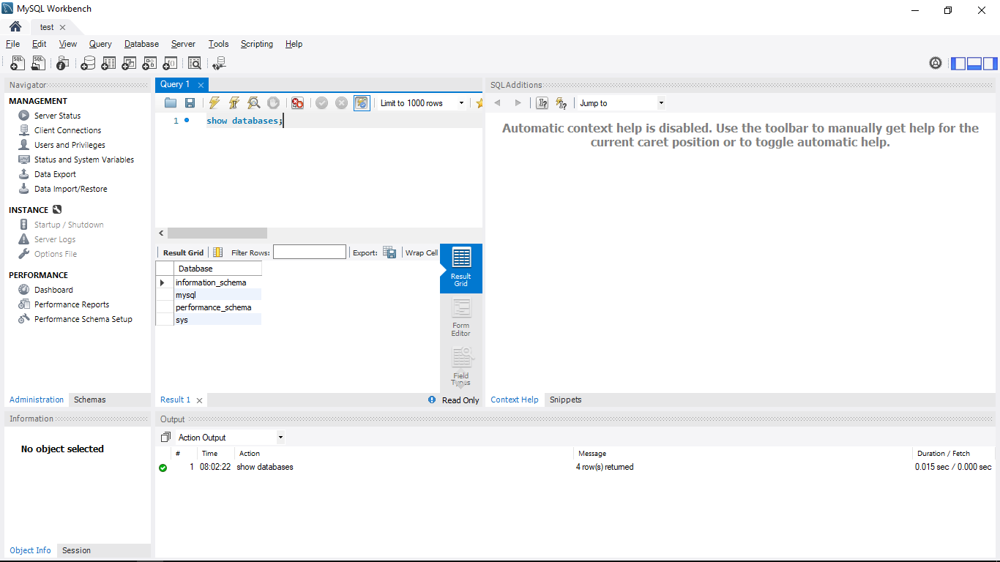
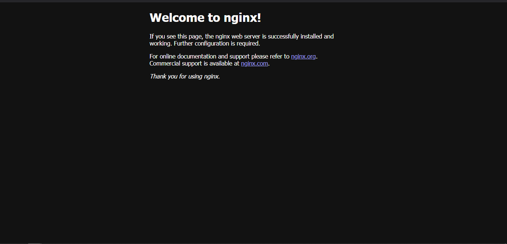

<div style="display: flex; justify-content: center; align-items: center; height: 100vh; text-align: center;">
  <h1 style="font-size: 5em;">Terraform Cookbook</h1>
</div>

---

## Table of Contents

---

## AWS

1. [EC2 Terraform](#deploy-svelte-website-on-ec2-using-terraform)_ _ _ _ _ _ _ _ _ _ _ _ _ _ _ _ _ _ _ _ _ _ _ _ _ _ _ _ _ _ _ _ _ _ _ _ _ _ _ _ _ _ _ _ _ _ _ _ _ _ _ _ _ _ _ _ 3
2. [CloudFront Terraform](#deploy-static-website-on-cloudfront-using-terraform)_ _ _ _ _ _ _ _ _ _ _ _ _ _ _ _ _ _ _ _ _ _ _ _ _ _ _ _ _ _ _ _ _ _ _ _ _ _ _ _ _ _ _ _ _ _ _ _ _ _ _ _8
3. [ECS Terraform](#ecs-provisioning-using-terraform)_ _ _ _ _ _ _ _ _ _ _ _ _ _ _ _ _ _ _ _ _ _ _ _ _ _ _ _ _ _ _ _ _ _ _ _ _ _ _ _ _ _ _ _ _ _ _ _ _ _ _ _ _ _ _ _11
4. [EKS Terraform](#eks-provisioning-using-terraform)_ _ _ _ _ _ _ _ _ _ _ _ _ _ _ _ _ _ _ _ _ _ _ _ _ _ _ _ _ _ _ _ _ _ _ _ _ _ _ _ _ _ _ _ _ _ _ _ _ _ _ _ _ _ _ _19

---

## Azure

1. [Virtual Machine Terraform](#azure-virtual-machine-provisioning-using-terraform)_ _ _ _ _ _ _ _ _ _ _ _ _ _ _ _ _ _ _ _ _ _ _ _ _ _ _ _ _ _ _ _ _ _ _ _ _ _ _ _ _ _ _ _ _ _ _ _ 27
2. [Container Apps Terraform](#container-apps-provisioning-using-terraform)_ _ _ _ _ _ _ _ _ _ _ _ _ _ _ _ _ _ _ _ _ _ _ _ _ _ _ _ _ _ _ _ _ _ _ _ _ _ _ _ _ _ _ _ _ _ _ _ 34
3. [AKS Terraform](#aks-provisioning-using-terraform)_ _ _ _ _ _ _ _ _ _ _ _ _ _ _ _ _ _ _ _ _ _ _ _ _ _ _ _ _ _ _ _ _ _ _ _ _ _ _ _ _ _ _ _ _ _ _ _ _ _ _ _ _ _ _ _42

---
<div style="page-break-after: always;"></div>

---

# Deploy Svelte Website on EC2 using Terraform
- We will provision the EC2 for Static & Dynamic Web Hosting.
- We will deploy it in a custom Virtual Private Cloud for isolation.
- We will configure the server with Nginx as a Reverse Proxy and attach an SSL Certificate for secure web access.
- We will also create a Route53 Hosted Zone and add a Route53 Record to access the website using the domain name.
- We will create all these resources using Terraform as an Infrastructure as Code.

---
## Prerequisites
---

1. AWS Account with IAM User Access Keys
2. Terraform installed
3. Website repository
4. Domain name

---
## Generate SSH Key Pair
---

First, we will generate an **SSH Key Pair** to SSH into the EC2 server once it is created and start the Svelte with Nodejs.

## Steps
1. Open the Powershell Window.
2. Run the following command to generate the ssh key pair and enter the location where you want to save the ssh key (C:/Users/user/.ssh/aws/ssh-keys/):
```sh
    ssh-keygen -t ed25519
```
3. SSH Key will be generated.

---
## Write Terraform Configuration files
---

Now we will write Terraform configuration files for AWS resources using predefined modules available on the internet.

## Steps
1. Create the **ec2-website-terraform** project directory.
2. The folder structure for the above-created directory is as follows:
```
ec2-website-terraform
│───.terraform.lock.hcl
│───locals.tf
│───main.tf
│───outputs.tf
│───providers.tf
│───terraform.tfstate
│───terraform.tfstate.backup
└───.terraform
```

> We need to only create *providers.tf*, *main.tf*, *outputs.tf*, & *locals.tf* file. Other files are generated while initiating terraform.

3. Create a *providers.tf* file inside the above-created directory.
4. Inside it, define the following:
    - terraform
        - required_providers
    - provider
        - aws
5. Click [code](https://github.com/inflection-zone/iac-recipes/blob/inflection-sahil/terraform/aws/ec2-website/providers.tf) for reference.
6. The definition of *providers.tf* file is complete.
7. Now create the *main.tf* file.
8. Define the following modules inside it:
    - module.vpc
    - module. ec2
9. Click [code](https://github.com/inflection-zone/iac-recipes/blob/inflection-sahil/terraform/aws/ec2-website/main.tf) for reference.
10. The definition of *main.tf* file is complete.
11. Now we will create *outputs.tf* file.
12. Inside it, define the following outputs
    - output.ec2-instance-public-ip
13. Click [code](https://github.com/inflection-zone/iac-recipes/blob/inflection-sahil/terraform/aws/ec2-website/outputs.tf) for reference.
14. The definition of *outputs.tf* file is complete.
15. Now we will create *locals.tf* file.
16. Inside it, define the following variables:
    - local.aws-region
    - local.vpc-properties
    - local.ec2-properties
17. Click [code](https://github.com/inflection-zone/iac-recipes/blob/inflection-sahil/terraform/aws/ec2-website/sample-locals.txt) for reference.
18. The definition of *locals.tf* file is complete.

> Ensure you give the appropriate values to the variables defined in *locals.tf* file.  
> In *ec2-properties.ec2-instance-public-key*, provide the above generated public SSH key path.

---
## Provisioning the Infrastructure
---

Now we will provision the AWS infrastructure by applying the above-created Terraform configuration files.
> Ensure AWS CLI is configured with appropriate IAM User Access Keys with enough permissions.

## Steps:
1. Open the PowerShell Window.
2. Change the directory to the above-created ec2-website-terraform directory using the **`cd`** command.
3. Run the **`terraform fmt -recursive`** command to format the syntax of the files.
4. Run the **`terraform init`** command to initialize the terraform.
5. Run the **`terraform validate`** command to validate the configuration files.
6. Run the **`terraform plan`** command to plan the resources to be created.
7. Run the **`terraform apply`** command and if prompted, type **`yes`** to provision the infrastructure.
8. Run the **`terraform output`** command to get the values of defined variables in outputs.tf file.
9. Head to the **AWS Console**, and verify the created resources.

---
## Route53 Configuration
---

Now we will configure the Route53 service for domain routing to the website.

## Steps
1. Login to the AWS console and search for the **Route-53** service.
2. Click open the Route-53 console.
3. In the left plane of the window, click on **`Hosted zones`**.
4. Create a new hosted zone for your domain name e.g. **`example.com`**.
5. On completing, two records of type **`NS`** and **`SOA`** gets created here.
6. Copy all four values from column **`Value/Route traffic to`** of **`NS`** record.
7. Go to your domain provider's website and add these copied nameservers in place of your domain's original nameservers. This will dedicate your domain to AWS.
8. Again go to the hosted zone added in the AWS Route-53 console.
9. Add a **`dev.example.com`**(replace with your domain name) record of type `A` pointing to your EC2 instance's IP address received from running **`terraform output`** command.

---
## SSH Into EC2 Server
---

Now we will SSH into the EC2 instance and configure the server for website deployment.

## Steps
1. Open the Powershell Window.
2. Run the following command to SSH into EC2 server and substitute the <*private-ssh-key-path*> with the above generated private ssh key path and <*ec2-instance-public-ip*> with the server IP received from **`terraform output`** command:
```sh
    ssh -o StrictHostKeyChecking=no -i <*private-ssh-key-path*> ec2-user@<*ec2-instance-public-ip*>
```
3. Once you enter the server, run the following commands to install the necessary dependencies for deployment:
```sh
    sudo yum update
    sudo yum install -y nodejs npm
    sudo npm install -g pm2
    sudo yum install -y nginx
    sudo yum install -y git
    sudo yum install -y certbot python3-certbot-nginx
    sudo npm install @sveltejs/adapter-node
```
4. Now clone the svelte git repository that you want to deploy by running and substituting the following link with your desired git repository link:
```sh
    git clone <https://github.com/account-name/repository-name.git>
```
5. Navigate to the website folder using the **`cd`** command and run the following commands to start the Nodejs server:
```sh
    sudo npm install @sveltejs/adapter-node
    sudo npm install
    sudo npm run build
    sudo pm2 start build/index.js --name "sveltekit-app"
    sudo pm2 save
    sudo pm2 startup
```
6. Now we will configure the Nginx as a Reverse Proxy with HTTPS to secure the web connection.
7. Click [code](https://github.com/inflection-sahil/website-devops/blob/master/nginx/default.conf) and copy the default.conf file and paste it into the vim terminal opened by running the following command. Also, replace the <*dev.example.com*> with your desired domain name. Click **`esc`** and type **`:wq`** to write the file.
8. Run the following commands to configure the Nginx:
```sh
    sudo vim /etc/nginx/conf.d/default.conf
    sudo systemctl restart nginx
    sudo certbot --nginx -d dev.example.com
    sudo certbot renew --dry-run
```
9. Nginx configuration is complete. Try accessing the website on the browser.

---
## Destroy the provisioned infrastructure
---

Lastly, we will destroy the above-created resources.

## Steps
1. To destroy infrastructure, open the Powershell Window and change the directory to the above-created **ec2-website-terraform** directory using the **`cd`** command.
2. Run **`terraform destroy`** & if prompted, type **`yes`**.
3. Infrastructure will be destroyed.

---


<div style="page-break-after: always;"></div>


# Deploy Static Website on CloudFront using Terraform
- We will provision the CloudFront for Static Website Delivery to users more quickly and securely.
- We will connect the CloudFront to ACM for secure web access.
- We will create S3 bucket to store the *static-website* files.
- We will also create a Route53 Hosted Zone and add a Route53 Record to access the website using the domain name.
- We will create all these resources using Terraform as an Infrastructure as Code.

---
## Prerequisites
---

1. AWS Account with IAM User Access Keys
2. Terraform installed
3. Website repository
4. Domain name

---
## Write Terraform Configuration files
---

First, we will write Terraform configuration files for AWS resources using predefined modules available on the internet.

## Steps
1. Create the **cloudfront-website-terraform** project directory.
2. The folder structure for the above-created directory is as follows:
```
cloudfront-website-terraform
│───.terraform.lock.hcl
│───locals.tf
│───main.tf
│───providers.tf
│───terraform.tfstate
│───terraform.tfstate.backup
└───.terraform
```

> We need to only create *providers.tf*, *main.tf*, & *locals.tf* file. Other files are generated while initiating terraform.

3. Create a *providers.tf* file inside the above-created directory.
4. Inside it, define the following:
    - terraform
        - required_providers
    - provider
        - aws
5. Click [code](https://github.com/inflection-zone/iac-recipes/blob/inflection-sahil/terraform/aws/cloudfront-website/providers.tf) for reference.
6. The definition of *providers.tf* file is complete.
7. Now create the *main.tf* file.
8. Define the following modules inside it:
    - module.s3
    - module.acm-route53
    - module. cloudfront
    - module.route53-record
9. Click [code](https://github.com/inflection-zone/iac-recipes/blob/inflection-sahil/terraform/aws/cloudfront-website/main.tf) for reference.
10. The definition of *main.tf* file is complete.
11. Now we will create *locals.tf* file.
12. Inside it, define the following variables:
    - local.aws-region
    - local.s3-properties
    - local.acm-properties
    - local.route53-zone-properties
    - local.cloudfront-properties
    - local.route53-record-properties
13. Click [code](https://github.com/inflection-zone/iac-recipes/blob/inflection-sahil/terraform/aws/cloudfront-website/sample-locals.txt) for reference.
14. The definition of *locals.tf* file is complete.

> Ensure you give the appropriate values to the variables defined in *locals.tf* file.  
> Also, ensure you set *aws-region* to **us-east-1**, as ACM will work with Cloudfront only & only if it is deployed in that region.

---
## Provisioning the Infrastructure
---

Now we will provision the AWS infrastructure by applying the above-created Terraform configuration files.

> Ensure AWS CLI is configured with appropriate IAM User Access Keys with enough permissions.

## Steps:
1. Open the PowerShell Window.
2. Change the directory to the above-created cloudfront-website-terraform directory using the **`cd`** command.
3. Run the **`terraform fmt -recursive`** command to format the syntax of the files.
4. Run the **`terraform init`** command to initialize the terraform.
5. Run the **`terraform validate`** command to validate the configuration files.
6. Run the **`terraform plan`** command to plan the resources to be created.
7. Run the **`terraform apply`** command and if prompted, type **`yes`** to provision the infrastructure.
8. Apply will take time, till then
    1. Login to the AWS console and search for the **Route-53** service.
    2. Click open the Route-53 console.
    3. In the left plane of the window, click on **`Hosted zones`**.
    4. Terraform will create a new hosted zone for your domain e.g. **`example.com`**.
    5. On completing, two records of type **`NS`** and **`SOA`** gets created here.
    6. Copy all four values from column **`Value/Route traffic to`** of **`NS`** record.
    7. Go to your domain provider's website and add these copied nameservers in place of your domain's original nameservers. This will dedicate your domain to AWS.
    8. Now, head to the AWS Console and search for the **S3** service.
    9. Click open the **S3** service, select the terraform provisioned bucket, and upload the static website files to it.
    10. This will store all the website files and deliver them once the CloudFront requests.
11. Once the terraform provisioning is completed, try accessing the static website on the browser.

---
## Destroy the provisioned infrastructure
---

Lastly, we will destroy the above-created resources.

## Steps
1. To destroy infrastructure, open the Powershell Window and change the directory to the above-created **cloudfront-website-terraform** directory using the **`cd`** command.
2. Run **`terraform destroy`** & if prompted, type **`yes`**.
3. Infrastructure will be destroyed.

---


<div style="page-break-after: always;"></div>


# ECS Provisioning using Terraform
- We will provision the ECS using Terraform as an Infrastructure as Code.
- We will deploy it in a custom Virtual Private Cloud for isolation.
- We will connect the Container App to ECR for Docker Image.
- We will also create S3 bucket to store the *.env* file.
- Also will deploy RDS MySQL Instance to store the relational data and connect it to ECS.

---
## Prerequisites
---

1. AWS Account with an IAM User with administrative permissions.
2. Terraform installed.

---
## Write Terraform Configuration files
---

First, we will write Terraform configuration files for AWS resources using predefined modules available on the internet.

## Steps
1. Create the **ecs-terraform** directory.
2. The folder structure for the above-created directory is as follows:
```
ecs-terraform
│───.terraform.lock.hcl
│───locals.tf
│───main.tf
│───outputs.tf
│───providers.tf
│───terraform.tfstate
│───terraform.tfstate.backup
└───.terraform
```

> We need to only create *providers.tf*, *main.tf*, *outputs.tf*, & *locals.tf* file. Other files are generated while initiating terraform.

3. Create a *providers.tf* file inside the above-created directory.
4. Inside it, define the following:
    - terraform
      - required_providers
    - provider
      - docker
      - aws
5. Click [code](https://github.com/inflection-zone/iac-recipes/blob/inflection-sahil/terraform/aws/ecs/providers.tf) for reference.
6. The definition of *providers.tf* file is complete.
7. Now, create the *main.tf* file.
8. Inside *main.tf* file, we will use the following predefined modules:
    - module.vpc
    - module.s3
    - module.rds
    - module.ecr
    - module.load-balancer
    - module.ecs
9. Also define the following s3 resource for uploading local .env file:
    - resource.aws_s3_object
10. Click [code](https://github.com/inflection-zone/iac-recipes/blob/inflection-sahil/terraform/aws/ecs/main.tf) for reference.
11. The definition of *main.tf* file is complete.
12. Now we will create *outputs.tf* file.
13. Inside it, define the following outputs.
    - output.DB_HOST
    - output.bastion-host-ip
14. Click [code](https://github.com/inflection-zone/iac-recipes/blob/inflection-sahil/terraform/aws/ecs/outputs.tf) for reference.
15. The definition of *outputs.tf* file is complete.
16. Now we will create *locals.tf* file.
17. Inside it, define the following variables:
    - local.vpc-properties
    - local.s3-properties
    - local.database-properties
    - local.bastion-properties
    - local.load-balancer-properties
    - local.ecs-properties
18. Click [code](https://github.com/inflection-zone/iac-recipes/blob/inflection-sahil/terraform/aws/ecs/sample-locals.txt) for reference.
19. The definition of *locals.tf* file is complete.

> Ensure you give the appropriate values to the variables defined in *locals.tf* file.  
> Also, update the *s3-object-source-path* variable under *s3-properties* with local *.env* file relative path.

---

## Provisioning the Infrastructure

---

Now we will provision the AWS infrastructure by applying the above-created configuration files.
> Ensure AWS CLI is configured with appropriate AWS user credentials and enough permissions.

## Steps:
1. Open the PowerShell.
2. Change the directory to the above-created **ecs-terraform** directory using **`cd`** command.
3. Run the **`terraform fmt -recursive`** command to format the syntax of the files.
4. Run the **`terraform init`** command to initialize the *terraform*.
5. Run the **`terraform validate`** command to validate the configuration files.
6. Run the **`terraform plan`** command to plan the resources to be created.
7. Run the **`terraform apply`** command and if prompted, type **`yes`** to provision the infrastructure.
8. Run the **`terraform output`** command to get the values of defined variables in *outputs.tf* file.
9. Head to the AWS Console, and verify the created resources.
10. Then,
    - Head towards EC2 dashboard.
    - Select *Load Balancers*, and select the created load balancer.
    - Copy the DNS address.
    - Paste the address in the browser to access the application.

---

## Screenshots of Provisioned Infrastructure

---

### VPC Image


---

<div style="page-break-after: always;"></div>

### S3 Image


---

### RDS Image


---

<div style="page-break-after: always;"></div>

### ALB Image


---

### ECS Image


---

<div style="page-break-after: always;"></div>

---
## Connection to the RDS database through Bastion Host using MySQL Workbench
---

Now, we will use MySQL Workbench to connect and access the MySQL RDS Database through above created Bastion Host.

## Steps
1. Open MySQL Workbench.
2. Click Add Connection.
3. Select connection method as **Standard TCP/IP over SSH**.
4. In SSH Hostname, enter *bastion-host-ip:22* where bastion-host-ip is received from the **`terraform output`** command.
5. In SSH Username, enter *ec2-user*.
6. In SSH Key File, select *bastion-key.pem* file passed in above *locals.tf* file from your local computer.
7. In MySQL Hostname, enter *DB_HOST* where DB_HOST is received from the **`terraform output`** command.
8. In the Password section, select *Store in Vault*, and enter the password passed in above-created *locals.tf* file.
9. Click *OK* and open the connection.
10. Now you can run MySQL commands to access databases and verify the successful connection of *ecs-container*.

---
<div style="page-break-after: always;"></div>

---
## Screenshots of MySQL Workbench
---

### Connection Page


---

### Commands Page


---
<div style="page-break-after: always;"></div>

---
## Destroy the provisioned infrastructure
---

Lastly, we will destroy the above-created resources.

## Steps
1. To destroy infrastructure, open the Powershell Window and change the directory to the above-created **ecs-terraform** directory using the **`cd`** command.
2. Run **`terraform destroy`** & if prompted, type **`yes`**.
3. Infrastructure will be destroyed.

---


<div style="page-break-after: always;"></div>


# EKS Provisioning using Terraform
- We will provision the EKS using Terraform as an Infrastructure as Code.
- We will deploy it in a custom Virtual Private Cloud for isolation.
- We will also deploy RDS MySQL Instance to store the relational data and connect it to EKS.

---
## Prerequisites
---

1. AWS Account with an IAM User with administrative permissions.
2. Terraform installed.
3. Kubectl installed.

---
## Write Terraform Configuration files
---

First, we will write Terraform configuration files for AWS resources using predefined modules available on the internet.

## Steps
1. Create the **eks-terraform** directory.
2. The folder structure for the above-created directory is as follows:
```
eks-terraform
│───.terraform.lock.hcl
│───locals.tf
│───main.tf
│───outputs.tf
│───providers.tf
│───terraform.tfstate
│───terraform.tfstate.backup
└───.terraform
```

> We need to only create *providers.tf*, *main.tf*, *outputs.tf*, & *locals.tf* file. Other files are generated while initiating terraform.

3. Create a *providers.tf* file inside the above-created directory.
4. Inside it, define the following:
    - terraform
      - required_providers
    - provider
      - aws
5. Click [code](https://github.com/inflection-zone/iac-recipes/blob/inflection-sahil/terraform/aws/eks/providers.tf) for reference.
6. The definition of *providers.tf* file is complete.
7. Now, create the *main.tf* file.
8. Inside *main.tf* file, we will use the following predefined modules:
    - vpc
    - rds
    - eks
9. Click [code](https://github.com/inflection-zone/iac-recipes/blob/inflection-sahil/terraform/aws/eks/main.tf) for reference.
10. The definition of *main.tf* file is complete.
11. Now we will create *outputs.tf* file.
12. Inside it, define the following outputs.
    - DB_HOST
    - bastion-host-ip
13. Click [code](https://github.com/inflection-zone/iac-recipes/blob/inflection-sahil/terraform/aws/eks/outputs.tf) for reference.
14. The definition of *outputs.tf* file is complete.
15. Now we will create *locals.tf* file.
16. Inside it, define the following variables:
    - vpc-properties
    - database-properties
    - bastion-properties
    - eks-properties
17. Click [code](https://github.com/inflection-zone/iac-recipes/blob/inflection-sahil/terraform/aws/eks/sample-locals.txt) for reference.
18. The definition of *locals.tf* file is complete.

> Ensure you give the appropriate values to the variables defined in *locals.tf* file.

---
## Provisioning the Infrastructure
---

Now we will provision the AWS infrastructure by applying the above-created configuration files.

> Ensure AWS CLI is configured with appropriate AWS user credentials and enough permissions.

## Steps:
1. Open the PowerShell.
2. Change the directory to the above-created **eks-terraform** directory using **`cd`** command.
3. Run the **`terraform fmt -recursive`** command to format the syntax of the files.
4. Run the **`terraform init`** command to initialize the *terraform*.
5. Run the **`terraform validate`** command to validate the configuration files.
6. Run the **`terraform plan`** command to plan the resources to be created.
7. Run the **`terraform apply`** command and if prompted, type **`yes`** to provision the infrastructure.
8. Run the **`terraform output`** command to get the values of defined variables in *outputs.tf* file.
9. Head to the AWS Console, and verify the created resources.

---

<div style="page-break-after: always;"></div>

---
## Screenshots of Provisioned Infrastructure
---

### VPC Image


---

### RDS Image


---

<div style="page-break-after: always;"></div>

### EKS Cluster Image


---

### EKS Node Group Image


---

<div style="page-break-after: always;"></div>

### EKS Nodes Image


---
## Connect to the EKS Cluster from Powershell
---

## Steps
1. Open a new Powershell window.
2. Run the following command to configure local kubectl with eks cluster:
```sh
aws eks --region <region-name> update-kubeconfig --name <cluster-name>
```
> Substitute <*region-name*> and <*cluster-name*> with the values defined in the above-created *locals.tf* file.
3. Now apply the Kubernetes manifest files of the application using the following command:
```sh
kubectl apply -f <file-path>
```
> Substitute <*file-path*> with the Kubernetes manifest file path.
4. To list them all, run **`kubectl get all`**.
5. If a Load Balancer type Service is present then try accessing the External IP of that service in the browser.

---
<div style="page-break-after: always;"></div>

---
## Connection to the RDS database through Bastion Host using MySQL Workbench
---

Now, we will use MySQL Workbench to connect and access the MySQL RDS Database through above created Bastion Host.

## Steps
1. Open MySQL Workbench.
2. Click Add Connection.
3. Select connection method as **Standard TCP/IP over SSH**.
4. In SSH Hostname, enter *bastion-host-ip:22* where bastion-host-ip is received from the **`terraform output`** command.
5. In SSH Username, enter *ec2-user*.
6. In SSH Key File, select *bastion-key.pem* file passed in above *locals.tf* file from your local computer.
7. In MySQL Hostname, enter *DB_HOST* where DB_HOST is received from the **`terraform output`** command.
8. In the Password section, select *Store in Vault*, and enter the password passed in above-created *locals.tf* file.
9. Click *OK* and open the connection.
10. Now you can run MySQL commands to access databases and verify the successful connection of *eks-nodes*.

---
<div style="page-break-after: always;"></div>

---
## Screenshots of MySQL Workbench
---

### Connection Page


---

### Commands Page


---
<div style="page-break-after: always;"></div>

---
## Destroy the provisioned infrastructure
---

Lastly, we will destroy the above-created resources.

## Steps
1. Firstly, delete all the Kubernetes Deployments using:
```sh
    kubectl delete -f <file-path>
```
> Substitute <*file-path*> with the Kubernetes manifest file path.
2. To destroy infrastructure, change the directory to the above-created **eks-terraform** directory using the **`cd`** command.
3. Run **`terraform destroy`** & if prompted, type **`yes`**.
4. Infrastructure will be destroyed.

---


<div style="page-break-after: always;"></div>


# Azure Virtual Machine Provisioning using Terraform
- We will provision the Azure Virtual Machine using Terraform as an Infrastructure as Code.
- We will deploy it in a custom Virtual Network for isolation.
- We will SSH into the Virtual Machine, and install the docker.
- Then, we will deploy the Nginx Container and try accessing it on the Web Browser.

---
## Prerequisites
---

1. Azure Account with Subscription.
2. Terraform installed.

---
## Write Terraform Configuration files
---

First, we will write Terraform configuration files for Azure resources using predefined modules available on the internet.

## Steps
1. Create the **virtual-machine-terraform** directory.
2. The folder structure for the above-created directory is as follows:
```
virtual-machine-terraform
│───.terraform.lock.hcl
│───locals.tf
│───main.tf
│───outputs.tf
│───providers.tf
│───terraform.tfstate
│───terraform.tfstate.backup
└───.terraform
```

> We need to only create *providers.tf*, *main.tf*, *outputs.tf*, & *locals.tf* files. Other files are generated while initiating terraform.

3. Create a *providers.tf* file inside the above-created directory.
4. Inside it, define the following:
    - terraform
      - required_providers
    - provider
      - azurerm
5. Click [code](https://github.com/inflection-zone/iac-recipes/blob/inflection-sahil/terraform/azure/virtual-machine/providers.tf) for reference.
6. The definition of *providers.tf* file is complete.
7. Now, create the *main.tf* file.
8. Inside *main.tf* file, we will use the following predefined modules:
    - module.resource-group
    - module.virtual-network
    - module.virtual-machine
9. Click [code](https://github.com/inflection-zone/iac-recipes/blob/inflection-sahil/terraform/azure/virtual-machine/main.tf) for reference.
10. The definition of *main.tf* file is complete.
11. Now we will create *outputs.tf* file.
12. Inside it, define the following outputs.
    - output.vm-public-ip
13. Click [code](https://github.com/inflection-zone/iac-recipes/blob/inflection-sahil/terraform/azure/virtual-machine/outputs.tf) for reference.
14. The definition of *outputs.tf* file is complete.
15. Now we will create *locals.tf* file.
16. Inside it, define the following variables:
    - local.resource-group-properties
    - local.virtual-network-properties
    - local.virtual-machine-properties
17. Click [code](https://github.com/inflection-zone/iac-recipes/blob/inflection-sahil/terraform/azure/virtual-machine/sample-locals.txt) for reference.
18. The definition of *locals.tf* file is complete.

> Ensure you give the appropriate values to the variables defined in *locals.tf* file.

---
## Provisioning the Infrastructure
---

Now we will provision the Azure infrastructure by applying the above-created configuration files.
> Ensure Azure CLI is configured with appropriate Azure Account credentials and enough permissions.

## Steps:
1. Open the PowerShell Window.
2. Change the directory to the above-created **virtual-machine-terraform** directory using the **`cd`** command.
3. Run the **`terraform fmt -recursive`** command to format the syntax of the files.
4. Run the **`terraform init`** command to initialize the *terraform*.
5. Run the **`terraform validate`** command to validate the configuration files.
6. Run the **`terraform plan`** command to plan the resources to be created.
7. Run the **`terraform apply`** command and if prompted, type **`yes`** to provision the infrastructure.
8. Run the **`terraform output`** command to get the values of defined variables in *outputs.tf* file.
9. Head to the Azure Console, and verify the created resources.

---
<div style="page-break-after: always;"></div>

---
## Screenshots of Provisioned Infrastructure
---

### Resource Group Image


---

### Virtual Network Image


---
<div style="page-break-after: always;"></div>

### Public IP Image


---

### Network Interface Card Image


---
<div style="page-break-after: always;"></div>

### Network Security Group Image


---

### Virtual Machine Image


---
<div style="page-break-after: always;"></div>

---
## SSH Into Azure VM
---

Now we will SSH into the Azure VM and configure it for Nginx container deployment.

## Steps
1. Open the Powershell Window.
2. Run the following command to SSH into Azure VM and substitute the <*admin-username*> with the value provided in *locals.tf* file under <*virtual-machine-properties*> section and <*vm-public-ip*> with the Azure VM Public IP received from **`terraform output`** command:
```sh
    ssh -o StrictHostKeyChecking=no <admin-username>@<vm-public-ip>
```
3. It will promt for password, enter the <*admin-password*> provided in the *locals.tf* file under <*virtual-machine-properties*> section.
4. Once you enter the server, run the following commands to install the necessary dependencies for deployment and run the nginx container:
```sh
    sudo apt update
    sudo apt install -y docker.io
    sudo docker run -d -p 80:80 nginx
```
9. Try accessing it on the browser using <*vm-public-ip*> received from **`terraform output`** command.

### Nginx Image


---
<div style="page-break-after: always;"></div>

---
## Destroy the provisioned infrastructure
---

Lastly, we will destroy the above-created resources.

## Steps
1. To destroy infrastructure, open the Powershell Window and change the directory to the above-created **virtual-machine-terraform** directory using the **`cd`** command.
2. Run **`terraform destroy`** & if prompted, type **`yes`**.
3. Infrastructure will be destroyed.

---


<div style="page-break-after: always;"></div>


# Container Apps Provisioning using Terraform
- We will provision the Container App using Terraform as an Infrastructure as Code.
- We will deploy it in a custom Virtual Network for isolation.
- We will connect the Container App to ACR for Docker Image.
- We will also create a Storage Account Container to store the *.env* file.
- Also will deploy MySQL Flexible to store the relational data and connect it to the Container App.

---
## Prerequisites
---

1. Azure Account with Subscription.
2. Terraform installed.

---
## Write Terraform Configuration files
---

First, we will write Terraform configuration files for Azure resources using predefined modules available on the internet.

## Steps
1. Create the **container-apps-terraform** directory.
2. The folder structure for the above-created directory is as follows:
```
container-apps-terraform
│───.terraform.lock.hcl
│───locals.tf
│───main.tf
│───outputs.tf
│───providers.tf
│───terraform.tfstate
│───terraform.tfstate.backup
└───.terraform
```

> We need to only create *providers.tf*, *main.tf*, *outputs.tf*, & *locals.tf* file. Other files are generated while initiating terraform.

3. Create a *providers.tf* file inside the above-created directory.
4. Inside it, define the following:
    - terraform
      - required_providers
    - provider
      - azurerm
5. Click [code](https://github.com/inflection-zone/iac-recipes/blob/inflection-sahil/terraform/azure/container-apps/providers.tf) for reference.
6. The definition of *providers.tf* file is complete.
7. Now, create the *main.tf* file.
8. Inside *main.tf* file, we will use the following predefined modules:
    - module.resource-group
    - module.virtual-network
    - module.acr
    - module.mysql-flexible
    - module.storage
    - module.container-apps-setup
    - module.container-apps
9. Click [code](https://github.com/inflection-zone/iac-recipes/blob/inflection-sahil/terraform/azure/container-apps/main.tf) for reference.
10. The definition of *main.tf* file is complete.
11. Now we will create *outputs.tf* file.
12. Inside it, define the following outputs.
    - output.acr-login-server
    - output.acr-admin-username
    - output.acr-admin-password
    - output.DB_HOST
    - output.container-apps-url
13. Click [code](https://github.com/inflection-zone/iac-recipes/blob/inflection-sahil/terraform/azure/container-apps/outputs.tf) for reference.
14. The definition of *outputs.tf* file is complete.
15. Now we will create *locals.tf* file.
16. Inside it, define the following variables:
    - local.resource-group-properties
    - local.virtual-network-properties
    - local.acr-properties
    - local.mysql-flexible-properties
    - local.storage-properties
    - local.container-apps-setup-properties
    - local.container-apps-properties
17. Click [code](https://github.com/inflection-zone/iac-recipes/blob/inflection-sahil/terraform/azure/container-apps/sample-locals.txt) for reference.
18. The definition of *locals.tf* file is complete.

> Ensure you give the appropriate values to the variables defined in *locals.tf* file.  
> Also update the *sb-object-source-path* variable under *storage-properties* with local *.env* file relative path.

---
<div style="page-break-after: always;"></div>

---
## Provisioning the Infrastructure
---

Now we will provision the Azure infrastructure by applying the above-created configuration files.
> Ensure Azure CLI is configured with appropriate Azure Account credentials and enough permissions.

> Also first provision the ACR, push the Docker Image, and then provision the Container App. To do that, comment out the **container-app** module and follow the further steps.

## Steps:
1. Open the PowerShell Window.
2. Change the directory to the above-created **container-apps-terraform** directory using the **`cd`** command.
3. Run the **`terraform fmt -recursive`** command to format the syntax of the files.
4. Run the **`terraform init`** command to initialize the *terraform*.
5. Run the **`terraform validate`** command to validate the configuration files.
6. Run the **`terraform plan`** command to plan the resources to be created.
7. Run the **`terraform apply`** command and if prompted, type **`yes`** to provision the infrastructure.
8. Once completed, head to the Azure Console, and verify the created resources.

---
## Screenshots of Provisioned Infrastructure
---

### Resource Group Image


---
<div style="page-break-after: always;"></div>

### Virtual Network Image


---

### ACR Image


---
<div style="page-break-after: always;"></div>

### MySQL Flexible Server Image


---

### Storage Account Container Image


---
<div style="page-break-after: always;"></div>

### Storage Account Container Env File


---
## Now push the Docker Image to ACR
---

## Steps
1. Open a new Powershell window.
2. Run the following commands to log into ACR:
```sh
    az login
    az acr login --name <acr-name>
```
3. Then tag & push the docker image using the following commands:
```sh
    docker tag <image-name:tag> <acr-name>.azurecr.io/<image-name:tag>
    docker push <acr-name>.azurecr.io/<image-name:tag>
```
Substitute <*acr-name*> with the value defined in the above-created *locals.tf* file. Also, substitute <*image-name:tag*> with its respective name.

---
<div style="page-break-after: always;"></div>

---
## Provisioning the Container App
---

> Uncomment the **container-app** module that we commented on earlier and follow the further steps.

### Steps:
1. Change window to the PowerShell.
2. Run the **`terraform fmt -recursive`** command to format the syntax of the files.
3. Run the **`terraform init`** command to initialize the *terraform*.
4. Run the **`terraform validate`** command to validate the configuration files.
5. Run the **`terraform plan`** command to plan the resources to be created.
6. Run the **`terraform apply`** command and if prompted, type **`yes`** to provision the infrastructure.
7. Once completed, head to the Azure Console, and verify the created resources.
8. Run the **`terraform output`** command to get the values of defined variables in *outputs.tf* file.
9. Then,
    - Copy the *container-app-url*.
    - Paste the address in the browser to access the application.

---

### Container Apps Image


---
<div style="page-break-after: always;"></div>

---
## Destroy the provisioned infrastructure
---

Lastly, we will destroy the above-created resources.

## Steps
1. To destroy infrastructure, open the Powershell Window and change the directory to the above-created **container-apps-terraform** directory using the **`cd`** command.
2. Run **`terraform destroy`** & if prompted, type **`yes`**.
3. Infrastructure will be destroyed.

---


<div style="page-break-after: always;"></div>


# AKS Provisioning using Terraform
- We will provision the AKS using Terraform as an Infrastructure as Code.
- We will deploy it in a custom Virtual Network for isolation.
- We will connect the AKS to ACR for Docker Image.
- We will also deploy MySQL Flexible to store the relational data and connect it to AKS.

---
## Prerequisites
---

1. Azure Account with Subscription.
2. Terraform installed.
3. Kubectl installed.

---
## Write Terraform Configuration files
---

First, we will write Terraform configuration files for Azure resources using predefined modules available on the internet.

## Steps
1. Create the **aks-terraform** directory.
2. The folder structure for the above-created directory is as follows:
```
aks-terraform
│───.terraform.lock.hcl
│───locals.tf
│───main.tf
│───outputs.tf
│───providers.tf
│───terraform.tfstate
│───terraform.tfstate.backup
└───.terraform
```

> We need to only create *providers.tf*, *main.tf*, *outputs.tf*, & *locals.tf* file. Other files are generated while initiating terraform.

3. Create a *providers.tf* file inside the above-created directory.
4. Inside it, define the following:
    - terraform
      - required_providers
    - provider
      - azurerm
5. Click [code](https://github.com/inflection-zone/iac-recipes/blob/inflection-sahil/terraform/azure/aks/providers.tf) for reference.
6. The definition of *providers.tf* file is complete.
7. Now, create the *main.tf* file.
8. Inside *main.tf* file, we will use the following predefined modules:
    - module.resource-group
    - module.virtual-network
    - module.acr
    - module.mysql-flexible
    - module.aks
9. Click [code](https://github.com/inflection-zone/iac-recipes/blob/inflection-sahil/terraform/azure/aks/main.tf) for reference.
10. The definition of *main.tf* file is complete.
11. Now we will create *outputs.tf* file.
12. Inside it, define the following outputs.
    - output.acr-login-server
    - output.acr-admin-username
    - output.acr-admin-password
    - output.DB_HOST
13. Click [code](https://github.com/inflection-zone/iac-recipes/blob/inflection-sahil/terraform/azure/aks/outputs.tf) for reference.
14. The definition of *outputs.tf* file is complete.
15. Now we will create *locals.tf* file.
16. Inside it, define the following variables:
    - local.resource-group-properties
    - local.virtual-network-properties
    - local.acr-properties
    - local.mysql-flexible-properties
    - local.aks-properties
17. Click [code](https://github.com/inflection-zone/iac-recipes/blob/inflection-sahil/terraform/azure/aks/sample-locals.txt) for reference.
18. The definition of *locals.tf* file is complete.

> Ensure you give the appropriate values to the variables defined in *locals.tf* file.

---
<div style="page-break-after: always;"></div>

---
## Provisioning the Infrastructure
---

Now we will provision the Azure infrastructure by applying the above-created configuration files.
> Ensure Azure CLI is configured with appropriate Azure Account credentials and enough permissions.

> Also first provision the ACR, push the Docker Image, and then provision the Container App. To do that, comment out the **aks** module and follow the further steps.

## Steps:
1. Open the PowerShell.
2. Change the directory to the above-created **aks-terraform** directory using **`cd`** command.
3. Run the **`terraform fmt -recursive`** command to format the syntax of the files.
4. Run the **`terraform init`** command to initialize the *terraform*.
5. Run the **`terraform validate`** command to validate the configuration files.
6. Run the **`terraform plan`** command to plan the resources to be created.
7. Run the **`terraform apply`** command and if prompted, type **`yes`** to provision the infrastructure.
8. Run the **`terraform output`** command to get the values of defined variables in *outputs.tf* file.
9. Head to the Azure Console, and verify the created resources.

---
## Screenshots of Provisioned Infrastructure
---

### Resource Group Image


---
<div style="page-break-after: always;"></div>

### Virtual Network Image


---

### ACR Image


---
<div style="page-break-after: always;"></div>

### MySQL Flexible Server Image


---
## Now push the Docker Image to ACR
---

## Steps
1. Open a new Powershell window.
2. Run the following commands to log into ACR:
```sh
az login
az acr login --name <acr-name>
```
3. Then tag & push the docker image using the following commands:
```sh
docker tag <image-name:tag> <acr-name>.azurecr.io/<image-name:tag>
docker push <acr-name>.azurecr.io/<image-name:tag>
```
> Substitute <*acr-name*> with the value defined in the above-created *locals.tf* file. Also, substitute <*image-name:tag*> with its respective name.

---
<div style="page-break-after: always;"></div>

---
## Provisioning the AKS
---

> Uncomment the **aks** module that we commented on earlier and follow the further steps.

## Steps:
1. Open the Powershell Window.
2. Run the **`terraform fmt -recursive`** command to format the syntax of the files.
3. Run the **`terraform init`** command to initialize the *terraform*.
4. Run the **`terraform validate`** command to validate the configuration files.
5. Run the **`terraform plan`** command to plan the resources to be created.
6. Run the **`terraform apply`** command and if prompted, type **`yes`** to provision the infrastructure.
7. Once completed, head to the Azure Console, and verify the created resources.
8. Run the **`terraform output`** command to get the values of defined variables in *outputs.tf* file.

---

### AKS Image


---
<div style="page-break-after: always;"></div>

---
## Connect to the AKS Cluster from Powershell
---

## Steps
1. Open a new Powershell window.
2. Run the following commands to configure local kubectl with aks cluster:
```sh
az login
az account set --subscription <subscription-id>
az aks get-credentials --resource-group <resource-group-name> --name <cluster-name> --overwrite-existing
```
> Substitute <*subscription-id*> which can be found by running **`az account list`** in the *id* field. Also, substitute <*resource-group-name*> and <*cluster-name*> with the values defined in the above-created *locals.tf* file.
3. Now apply the Kubernetes manifest files of the application using the following command:
```sh
kubectl apply -f <file-path>
```
> Substitute <file-path> with the Kubernetes manifest file path.
4. To list them all, run **`kubectl get all`**.
5. If a Load Balancer type Service is present then try accessing the External IP of that service in the browser.

---
## Destroy the provisioned infrastructure
---

Lastly, we will destroy the above-created resources.

## Steps
1. Firstly, delete all the Kubernetes Deployments using:
    - **`kubectl delete -f "file-path"`**  
    Substitute *file-path* with the Kubernetes manifest file path.
2. To destroy infrastructure, change the directory to the above-created **aks-terraform** directory using the **`cd`** command.
3. Run **`terraform destroy`** & if prompted, type **`yes`**.
4. Infrastructure will be destroyed.

---
